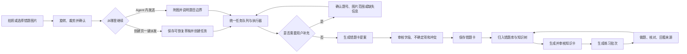
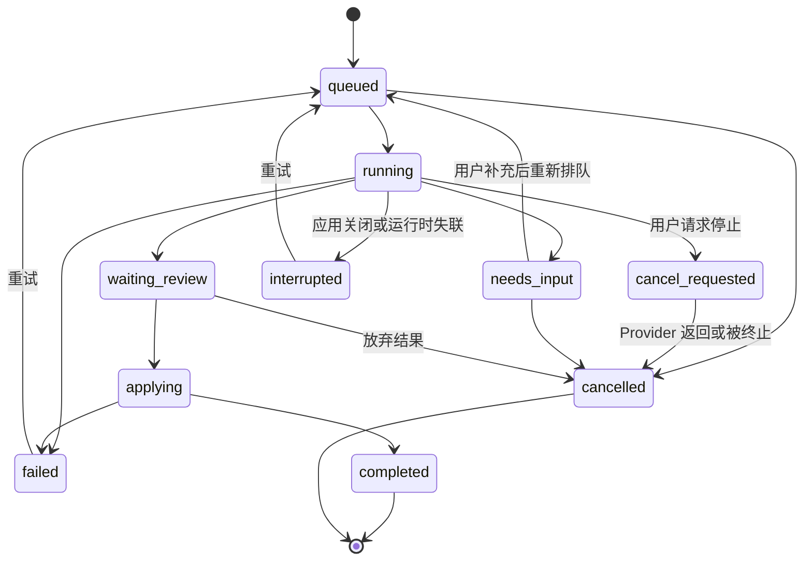

# 知拾 AI 学习闭环：全流程功能清单

> 文档状态：目标方案基线（PRD 前置输入）  
> 版本：1.0  
> 日期：2026-09-05  
> 适用范围：错题采集、照片整理、Agent、错题卡、知识卡、练习题与复习闭环  
> 后续权威文档：[AI 生成练习卡 PRD](./AI生成练习卡-PRD.md)

## 0. 这份文件解决什么问题

这不是页面清单，而是一份“用户能完成什么、系统在每个状态做什么、失败后如何恢复”的功能台账。专业团队应先冻结本文件，再画原型、拆开发任务和写测试，避免页面做完后才发现任务入口、保存语义或异常分支互相冲突。

本文件使用三种变更标记：

- **保留**：现有能力应继续存在，重设计不得遗漏。
- **调整**：现有能力存在，但入口、语义或状态需要统一。
- **新增**：为照片直传、一键派发或完整闭环补齐的能力。

所有功能 ID 都应在 PRD、原型、开发任务和验收记录中保持一致。仅标记“页面完成”不能替代逐项验收。

## 1. 先冻结的产品规则

### 1.1 入口规则

1. **全应用只有一个“打开 Agent”的入口**：右下角全局 Agent 按钮。它只负责打开或恢复 Agent，不自动读取页面正文，也不自动开始任务。
2. **创建页允许一个明确的任务动作**：`AI 整理这道错题`。它是“立即创建并派发照片错题整理任务”，不是第二个 Agent 呼出按钮；点击后不再经过设置窗，也不默认弹开 Agent。
3. **Agent 内的任务卡不是外部入口**：用户已经进入 Agent 后，才选择“整理错题 / 生成知识卡 / 生成练习”等任务。
4. 页面不得再出现含义宽泛的“交给 Agent”“用 AI 处理”“打开智能助手”等重复入口。
5. 创建页快捷动作与 Agent 内上传照片必须复用同一任务类型、校验器、状态模型和结果协议，不建立两套业务逻辑。

### 1.2 写入与确认规则

1. 点击 `AI 整理这道错题` 表示授权本次任务读取当前草稿与照片并生成建议，不表示授权自动保存正式错题卡。
2. AI 输出统一为可审核提案；用户明确应用后才进入编辑草稿，最后点击 `保存错题卡` 才形成正式卡片 revision。
3. Agent 从照片新建卡片时，每张提案提供明确的 `保存这张错题卡` 或 `放弃`；保存动作本身就是写操作批准。
4. AI 不得静默覆盖用户在任务运行期间修改的字段；冲突字段必须逐项提示。
5. 手工创建、编辑、保存和删除始终可用，不依赖 AI 连接。

### 1.3 并发、队列与恢复规则

1. V1 只有一个 Agent 执行器，同一时间只运行一个模型任务。
2. 用户一键派发时若执行器空闲，任务立即运行；若已有任务，仍立即创建任务并进入持久化队列，绝不覆盖旧任务，也不要求用户重新操作。
3. 队列只是保证一键派发成功的最小能力，不扩展为多 Agent 编排平台。
4. 收起 Agent、切页或关闭结果面板不会取消任务。应用内导航后必须恢复任务、进度、失败和待审核结果。
5. 🔶 **假设**：V1 重启应用后可恢复任务记录和待审核结果；若运行中的远端请求无法续接，应恢复为“已中断，可重试”，不得假装仍在运行。

### 1.4 选择控件规则

1. 普通错题卡、知识卡和来源卡片不显示无说明的勾选框。
2. 加入任务使用带动词的 `加入任务 / 移出任务`；卡片整体仍可点击进入详情。
3. 只有在“逐字段采纳建议”或“明确进入批量管理模式”时可使用选择框，并必须就近显示选择目的、已选数量和批量动作。

### 1.5 题目边界规则

1. 创建页代表“一张错题卡”：当前页的多张照片默认属于同一道题的不同部分。
2. 若 AI 检测到照片中含多道互不相关的题，任务进入“需要确认”，不得擅自合并或拆卡。
3. Agent 内只有在用户明确要求“分别整理多道题”时才可生成多张独立提案；V1 单次最多 10 张，每张单独保存或放弃。
4. 用户指定题号或小问时，AI 只能整理该题或该小问；无法确定边界时先请求确认。

## 2. 目标用户旅程

## 3. 入口职责表

| 入口 | 用户心智 | 点击后的唯一行为 | 不允许做的事 |
|---|---|---|---|
| 全局 `AI Agent` | “打开我的 AI 工作区” | 无活动任务时打开 Agent 首页；有活动任务时恢复最近任务 | 不自动发送、不读取完整卡片、不替换任务 |
| 创建页 `AI 整理这道错题` | “现在整理当前照片/内容” | 原子保存草稿快照并派发 `organize_mistake` 任务 | 不先开设置窗；不自动正式保存；不叫“打开 Agent” |
| Agent 内 `整理错题` | “在 Agent 中建立一个整理任务” | 进入任务草稿，可添加图片、文字、卡片引用和要求 | 不与全局入口并列出现在业务页面 |
| `加入任务 / 移出任务` | “决定本次 AI 能读哪些材料” | 改变任务草稿的显式来源列表 | 不立即调用模型；不等同批准保存 |
| `保存这张错题卡` | “确认这张提案成为正式资料” | 执行一次明确写入并返回保存结果 | 不批量暗中保存其他提案 |

## 4. 全流程功能台账

### 4.1 基础环境与导航

| ID | 变更 | 功能 | 目标行为、状态与副作用 | 最小验收 |
|---|---|---|---|---|
| BAS-001 | 保留 | 桌面与浏览器环境标识 | 桌面可调用真实 AI、工具和本地文件；浏览器仅预览/模拟，始终显示环境标识 | 两种环境分别走查，浏览器成功不得记为桌面成功 |
| BAS-002 | 保留 | 全局导航 | 可进入错题库、新增错题、AI 接入；未知路由回到安全默认页 | 路由、加载、错误和窄屏均有明确状态 |
| BAS-003 | 调整 | 唯一 Agent 启动器 | 所有主要页面只保留同一位置、同一行为的全局 Agent 按钮 | 静态扫描没有第二个“打开 Agent”控件 |
| BAS-004 | 新增 | Agent 全局状态徽标 | 收起后显示运行中、排队、需补充、待审核或失败的最高优先级状态及数量 | 状态更新不抢焦点；可键盘打开对应任务 |
| BAS-005 | 调整 | 返回原位置 | 从详情、审核或 AI 接入返回时恢复合理的来源页、筛选、标签和滚动上下文 | 端到端返回不固定跳回首页，不丢当前工作范围 |

### 4.2 照片与原始材料采集

| ID | 变更 | 功能 | 目标行为、状态与副作用 | 最小验收 |
|---|---|---|---|---|
| CAP-001 | 保留 | 选择或拖入图片 | 支持 PNG、JPG/JPEG、WebP；选择和拖放进入同一处理流程 | 文件选择与拖入结果一致 |
| CAP-002 | 调整 | 文件前置校验 | 单张不超过 15MB；派发前再按当前 Provider 能力校验张数与累计大小（当前通用 API 上限为 32MiB）；类型、大小、损坏文件分别给出原因和下一步 | 所有限制在调用模型前可见；错误被辅助技术播报，输入和其他图片保留 |
| CAP-003 | 保留 | 图片预处理 | 导入前可左/右旋转、框选裁剪、重置、预览和取消 | 取消不导入；确认后预览与导出一致 |
| CAP-004 | 调整 | 多图顺序 | 同一道题可含多张图片，显示页序并可重排或删除；拖动必须有按钮/键盘替代 | 重排后任务和最终卡均保持相同顺序 |
| CAP-005 | 新增 | 拍照入口预留 | 在支持相机的平台可调用拍照；不支持时自然回退文件选择 | 权限拒绝或无相机不阻塞文件上传 |
| CAP-006 | 新增 | 题目边界说明 | 每组图片附近显示“默认视为同一道题”；可填写题号、小问或“分别成卡”要求 | 指定 `44(2)` 时提案不包含 `44(1)` |
| CAP-007 | 新增 | 图片可用性提示 | 模糊、遮挡、方向错误、题干不完整时，在派发前或任务中给出可行动提示 | 用户可更换/补图或仍选择继续 |
| CAP-008 | 调整 | 临时资产所有权 | 明确 `borrowed`（草稿/已有卡只读来源）、`owned_upload`（Agent 本轮上传）和 `derived`（提案裁切/副本）三种角色；任务绝不清理 borrowed，正式写入时原子转移或复制所有权 | 放弃、保存、多提案分别验证清理和保留，取消任务不能删除原卡图片 |

### 4.3 错题草稿与手工编辑

| ID | 变更 | 功能 | 目标行为、状态与副作用 | 最小验收 |
|---|---|---|---|---|
| CARD-001 | 保留 | 最低保存条件 | 题目文字或至少一张图片存在即可保存草稿；完全空白阻止保存 | 仅文字、仅图片、完全空白各测一次 |
| CARD-002 | 保留 | 结构化字段 | 支持学科、题目、我的答案、正确答案、正确解法、第一处错误、错误原因、错误类型、补充说明 | 字段可手工填写且不依赖 AI |
| CARD-003 | 保留 | 知识点归档 | 可关联最多 3 个主要知识点，支持已有路径和新增名称 | 重复、空值、上限均有反馈 |
| CARD-004 | 保留 | 自动暂存 | 编辑变化后自动保存本地草稿，显示“正在暂存 / 已暂存 / 暂存失败” | 离开并返回能恢复；暂存不冒充正式保存 |
| CARD-005 | 调整 | 稳定采集草稿 ID | 新建页首次添加有效材料时建立稳定 `captureDraftId`，供图片和 Agent 任务绑定 | 切页、排队和任务完成后仍指向同一草稿 |
| CARD-006 | 保留 | 正式保存与状态计算 | 用户明确保存后创建/更新卡片 revision，并按字段完整度计算“待完善/已整理” | 保存成功才清除对应本地草稿 |
| CARD-007 | 保留 | revision 冲突保护 | 更新携带 `expectedRevision`；冲突时拒绝覆盖并保留用户草稿 | 两个编辑上下文并发保存，后者不能静默覆盖 |
| CARD-008 | 保留 | 删除与离开保护 | 删除需确认；离开有未保存内容时提供继续编辑、保存草稿、放弃 | 每个选择的卡片和图片副作用可验证 |

### 4.4 创建页一键派发

| ID | 变更 | 功能 | 目标行为、状态与副作用 | 最小验收 |
|---|---|---|---|---|
| DSP-001 | 新增 | 明确的一键动作 | 有题目文字或已确认图片后显示主动作 `AI 整理这道错题`；无有效材料时禁用并说明原因 | 按钮名称和辅助说明不含“打开 Agent”歧义 |
| DSP-002 | 新增 | 零设置派发 | 点击后直接使用当前 Provider、照片整理任务的安全默认策略和当前补充要求，不打开第二个配置窗口，也不继承 Agent 普通聊天的 `chat_only` 临时选项 | 从点击到收到任务 ID 只需一次用户动作 |
| DSP-003 | 新增 | 原子任务快照 | 一次操作完成草稿暂存、资产绑定、字段快照、任务创建和幂等键生成 | 任一步失败不得留下“显示已派发但无可恢复任务”的半状态 |
| DSP-004 | 新增 | 幂等防重复 | 派发中按钮禁用并显示加载；相同草稿 revision 的重复点击返回同一任务 | 双击、回车重复提交和慢响应不创建重复任务 |
| DSP-005 | 新增 | 立即反馈 | 300ms 内切换为“正在派发”；成功显示“已开始”或“已排队（前方 N 项）” | 状态使用 `role=status`，不靠颜色单独表达 |
| DSP-006 | 新增 | 运行后继续编辑 | 派发后用户仍可编辑；任务使用提交时快照，新修改不会假装影响已发送请求 | UI 明确显示快照时间/版本与“修改未发送” |
| DSP-007 | 新增 | 进入 Agent 查看 | 任务状态旁提供 `在 Agent 中查看`，只负责定位任务，不再次派发 | 打开后定位同一 `taskId`，无重复消息或任务 |
| DSP-008 | 新增 | 忙时自动排队 | 执行器忙时创建 `queued` 任务并显示顺位；任务来源和草稿已安全保留 | 运行中再连续派发两项，顺序和内容不串单 |
| DSP-009 | 新增 | 派发失败恢复 | AI 未配置、资产失败或任务创建失败时保留草稿，提供重试和 `前往 AI 接入` | 配置后返回原草稿，可一键重试 |

### 4.5 Agent 工作区与照片输入

| ID | 变更 | 功能 | 目标行为、状态与副作用 | 最小验收 |
|---|---|---|---|---|
| AGT-001 | 调整 | Agent 首页 | 空闲时展示普通对话输入和三类任务；有活动任务时先恢复任务 | 打开 Agent 本身不创建任务或调用模型 |
| AGT-002 | 保留 | 文本、图片与卡片引用 | 支持文字、拖入/选择图片和 `@` 引用；发送前可移除，所有输入有可见标签/说明 | 单轮最多 3 图的暂定上限被清楚提示 |
| AGT-003 | 新增 | 照片整理任务草稿 | 选择“整理错题”后显示图片、题目边界、已有字段、补充要求与最终动作摘要 | 修改任务草稿不调用模型 |
| AGT-004 | 调整 | 普通对话边界 | 普通问答不自动升级为写卡任务；检测到明确创建意图时先展示任务草稿 | “解释这道题”和“把它存成错题卡”结果不同 |
| AGT-005 | 保留 | 工具权限 | 搜索/读取自动执行；创建、修改、删除必须显示目标和影响并获批准 | 拒绝后业务数据和资产不变 |
| AGT-006 | 调整 | 运行时间线 | 展示排队、准备、读取图片、分析、校验、需补充、待审核、完成、失败、取消 | 每个状态都有文本、时间和下一步 |
| AGT-007 | 保留 | 停止本轮 | 运行中可停止；停止后不执行尚未批准的写入，迟到事件不反转为成功 | 取消和迟到回调场景有测试 |
| AGT-008 | 新增 | 最小任务列表 | Agent 内可查看当前、排队和最近待处理任务；默认聚焦最高优先级待办 | 不引入并行 Agent、复杂依赖图或管理员控制台 |
| AGT-009 | 调整 | 新对话 | 新对话只能由明确控件触发，只重置普通聊天上下文；持久化任务、提案和队列留在任务列表，取消任务必须使用任务自身动作 | 不因一句聊天文本或新对话清空任务、提案与资产 |

### 4.6 AI 理解与错题卡提案

| ID | 变更 | 功能 | 目标行为、状态与副作用 | 最小验收 |
|---|---|---|---|---|
| REV-001 | 调整 | 统一提案协议 | 创建页与 Agent 均返回同一结构：字段值、证据来源、不确定性、warnings、输入 revision | 两入口对同一输入可进入同一审核组件/校验器 |
| REV-002 | 新增 | 图片文字与数学内容 | 提取题干、公式、图形说明和题号；保留 Markdown/LaTeX 安全渲染 | 公式可读，原始 HTML/脚本不能执行 |
| REV-003 | 保留 | 错题诊断 | 在证据充分时建议答案、解法、第一处错误、错误原因、错误类型和知识点 | 无作答时不得虚构“我的第一处错误” |
| REV-004 | 调整 | 证据标记 | 建议字段标记来自图片、用户文字、已有卡片或推断 | 用户能查看为什么得出该字段 |
| REV-005 | 保留 | 不确定性 | 不确定字段默认不自动应用，并显示简短原因和补充办法 | 模糊或缺题干输入必须出现可行动 warning |
| REV-006 | 保留 | 编辑冲突 | 任务快照后用户改过的字段标记“你已修改”，默认保留用户新值 | 应用其他字段不覆盖冲突字段 |
| REV-007 | 调整 | 明确的字段选择 | 审核区标题写明“选择要应用到草稿的建议”；支持全选确定项、逐项应用和拒绝全部 | 选择框仅在此明确语境出现，不使用无说明裸框 |
| REV-008 | 新增 | 多题拆分确认 | 创建页检测多题时进入 `needs_input`；Agent 显式多题任务返回最多 10 张独立提案 | 每张有独立 ID、图片资产、保存和放弃状态 |

### 4.7 保存、错题库与检索

| ID | 变更 | 功能 | 目标行为、状态与副作用 | 最小验收 |
|---|---|---|---|---|
| LIB-001 | 保留 | 正式保存错题卡 | 创建页审核后保存当前草稿；Agent 提案点击 `保存这张错题卡` 后创建卡片 | 成功、失败、重复批准分别可验证 |
| LIB-002 | 保留 | 图片随卡片保留 | 正式卡引用自己的稳定资产；多提案不得共享会被单卡删除的可变资产 | 删除一张多卡提案不破坏其余卡图片 |
| LIB-003 | 保留 | 错题库列表 | 按更新时间查看摘要、草稿/已整理状态、图片、错因、知识点和错误类型 | loading、读取失败、空状态、无匹配结果分开 |
| LIB-004 | 保留 | 搜索与知识树筛选 | 题目内容搜索与学科/章节/知识点筛选职责清楚并可叠加 | 当前条件可见，可逐项清除 |
| LIB-005 | 调整 | 详情与来源返回 | 查看完整字段、原图和 revision；返回时恢复来源筛选与位置 | 从审核结果打开再返回不丢任务状态 |
| LIB-006 | 保留 | 编辑与重新整理 | 已有卡可手工编辑；如需 AI，进入同一编辑/审核链路并携带 revision | 详情页不增加含糊的第二个 Agent 呼出按钮 |
| LIB-007 | 保留 | 删除影响说明 | 删除前显示会影响的知识卡来源和练习追溯；删除后保留可解释的“来源已删除”状态 | 不留下可点击但无目标的链接 |

### 4.8 知识卡沉淀

| ID | 变更 | 功能 | 目标行为、状态与副作用 | 最小验收 |
|---|---|---|---|---|
| KNOW-001 | 保留 | 按知识点聚合 | 同一知识点聚合相关错题、错误样本和覆盖信息 | 无具体知识点时不伪造来源 |
| KNOW-002 | 保留 | 来源可追溯 | 知识卡记录每张来源错题 ID 与 revision，可返回原卡 | 来源变化或删除时明确显示 |
| KNOW-003 | 调整 | AI 知识任务 | 可在 Agent 中选择明确错题来源生成/完善知识卡；来源使用 `加入任务/移出任务` | 普通卡片列表无裸勾选框 |
| KNOW-004 | 保留 | 草稿优先 | AI 生成结果先持久化为待审核知识草稿，不直接替换已保存内容 | 切页返回仍可审核、保存或放弃 |
| KNOW-005 | 调整 | 版本与回滚 | 新草稿不销毁上一已保存版本；放弃草稿恢复上一正式版本 | 重生成、放弃和来源过期均不造成数据丢失 |
| KNOW-006 | 保留 | 过期保护 | 来源 revision 变化后，旧草稿标记过期并阻止直接保存，可重新生成 | 修改一张来源卡后复现过期状态 |

### 4.9 练习生成与复习

| ID | 变更 | 功能 | 目标行为、状态与副作用 | 最小验收 |
|---|---|---|---|---|
| PRAC-001 | 调整 | 明确来源 | 可将知识卡、错题或两者加入练习任务；来源、数量和 revision 始终可见 | 加入/移出不立即调用模型 |
| PRAC-002 | 保留 | 生成参数 | 支持难度、数量、题型/侧重点等补充要求；参数一次可见 | 输入有标签、说明、约束和键盘操作 |
| PRAC-003 | 保留 | 数量约束 | 至少覆盖每张选定来源；V1 总量上限 50 | 下限随来源变化并提供解释 |
| PRAC-004 | 调整 | 批次计划确认 | 生成前展示来源、数量、预计影响和写入位置，用户批准后才运行 | 计划与最终输出数量差异可追踪 |
| PRAC-005 | 保留 | 确定性校验 | 校验结构、知识点关联、来源 revision、空字段和数量 | 校验失败不落部分脏数据 |
| PRAC-006 | 调整 | 批次写入 | 合格结果以事务方式写入练习库；部分模型输出不合格时显示明细并按冻结策略处理 | 不出现 UI 显示 10 张、库内只有 7 张却无说明 |
| PRAC-007 | 新增 | 批次管理 | 新批次可查看、筛选、删除或撤销；只有进入批量管理后才显示选择框及批量工具栏 | 勾选含义、数量和影响明确 |
| PRAC-008 | 保留 | 练习与回看 | 做题、翻面查看答案/解法，并跳回准确来源错题和 revision | 来源已删除时显示不可用原因 |

### 4.10 任务状态、异常与恢复

| ID | 变更 | 功能 | 目标行为、状态与副作用 | 最小验收 |
|---|---|---|---|---|
| OPS-001 | 新增 | 统一任务状态机 | 本地提交先显示短暂 `dispatching`；任务状态为 `queued / running / cancel_requested / needs_input / waiting_review / applying / completed / failed / cancelled / interrupted` | 所有入口只使用这一组状态及迁移规则；请求尚未真正终止时不得提前显示 cancelled |
| OPS-002 | 新增 | 状态持久化 | 持久化任务 ID、类型、来源快照、草稿绑定、状态、进度摘要、结果引用和错误码 | 切页后恢复；重启后不出现幽灵运行态 |
| OPS-003 | 新增 | 单执行器调度 | 按创建顺序串行执行；需用户补充/审核的任务不占用模型执行器 | 一个任务待审核时，下一个排队任务可按策略继续 |
| OPS-004 | 新增 | 用户补充后恢复 | `needs_input` 展示明确问题；补充内容形成新任务 revision，再从可恢复阶段继续 | 补图、确认题号、改为多卡均可继续 |
| OPS-005 | 调整 | 失败分类 | 区分未配置、认证、网络、限流、图片、模型解析、校验、保存和 revision 冲突 | 每类错误提供保留内容后的下一步 |
| OPS-006 | 新增 | 安全重试 | 重试复用同一来源快照并生成新 attempt，不重复写入已完成结果 | 网络失败重试不产生重复卡片 |
| OPS-007 | 新增 | 取消与清理 | 排队可取消，运行可停止，待审核可放弃；只清理不再被草稿/提案引用的临时资产 | 三种取消阶段分别验证资产和卡片数量 |
| OPS-008 | 新增 | 待处理中心 | 全局徽标与 Agent 任务列表可定位需补充、待审核和失败任务 | 用户无需回忆任务来自哪个页面 |
| OPS-009 | 新增 | 应用关闭语义 | 明确区分“可离开本页”和“可关闭应用”；关闭时运行任务恢复为可解释状态 | 文案不承诺后台进程在应用关闭后继续 |
| OPS-010 | 调整 | 成功落点 | 后台完成只更新状态与轻提示，不抢焦点；用户主动打开结果 | 当前正在填写的表单不被自动导航打断 |

### 4.11 安全、隐私、无障碍与度量

| ID | 变更 | 功能 | 目标行为、状态与副作用 | 最小验收 |
|---|---|---|---|---|
| GOV-001 | 保留 | 凭据边界 | API Key 进入系统凭据库且不回显；浏览器预览不保存真实凭据 | 保存、重进、留空更新和删除分别验证 |
| GOV-002 | 新增 | 图片隐私说明 | 首次向外部 Provider 发送图片前说明发送对象与用途；本地/远端边界可查看 | 用户可取消且草稿保留 |
| GOV-003 | 保留 | 内容安全渲染 | 用户与 AI 内容支持安全 Markdown/LaTeX，不执行原始 HTML | 注入测试无可执行 DOM |
| GOV-004 | 调整 | 最小遥测 | 仅记录任务状态、耗时、错误码、来源数量、审核与保存事件；默认不记录题目正文、图片、完整提示词或密钥 | 日志审计不含敏感正文 |
| GOV-005 | 新增 | 可访问名称 | 所有按钮、图标、上传区、状态、字段和错误都有可访问名称或关联说明 | 屏幕阅读器能分辨“打开 Agent”和“派发整理任务” |
| GOV-006 | 新增 | 键盘与焦点 | 全流程可用键盘完成；弹窗管理焦点，关闭后返回触发控件；无键盘陷阱 | Tab、Enter、Space、Escape 逐流程走查 |
| GOV-007 | 新增 | 异步播报 | 派发、排队、运行、完成和错误使用克制的上下文状态播报，不移动焦点 | 状态更新可听懂且不会重复轰炸 |
| GOV-008 | 新增 | 可读与动效 | 正文对比度不低于 4.5:1，触控目标合理，200% 缩放可用，尊重减少动态效果设置 | 桌面宽/窄窗口与缩放分别验收 |

## 5. 两条照片整理主流程

### 5.1 创建页：一键派发一张错题

1. 用户进入“新增错题”。
2. 选择/拖入照片，完成旋转和裁剪；也可补充题目文字、我的答案或特殊要求。
3. 页面显示“这些图片默认属于同一道题”和 `AI 整理这道错题`。
4. 用户点击一次；系统立即禁用重复提交并显示“正在派发”。
5. 系统原子完成：
   - 建立或更新 `captureDraftId`；
   - 暂存当前字段与已处理图片；
   - 固化 `sourceRevision` 和资产顺序；
   - 创建 `organize_mistake` 任务与 `idempotencyKey`；
   - 空闲则运行，忙碌则排队。
6. 页面显示任务状态及 `在 Agent 中查看`；用户可继续编辑或离开。
7. AI 若无法确认题目边界，任务进入“需要补充”，不会擅自生成。
8. 结果进入逐字段审核。用户查看原图证据、warnings、不确定项和编辑冲突。
9. 用户应用选定建议，建议只写入当前草稿。
10. 用户点击 `保存错题卡` 后才生成正式卡片 revision；随后进入详情并可在错题库找到。

### 5.2 Agent：上传照片并生成一张或多张错题卡

1. 用户从唯一全局按钮打开 Agent。
2. 选择“整理错题”，或输入明确的建卡请求。
3. 添加 1～3 张照片，填写题号/小问和补充要求；多题时明确要求“分别成卡”。
4. 发送后创建同一种 `organize_mistake` 任务；无需再经过页面设置窗。
5. Agent 时间线展示任务状态，必要时请求补图或确认拆分。
6. 单题返回一张提案；明确多题时最多返回 10 张独立提案。
7. 用户逐张查看并选择 `保存这张错题卡` 或 `放弃`。
8. 保存是一次明确写操作批准；成功后显示卡片链接，失败时保留提案可重试。
9. 未处理的其他提案保持原状态，单张操作不影响其图片资产。

## 6. 其他端到端旅程

| 旅程 | 主路径 | 必须覆盖的分支 |
|---|---|---|
| J-01 快速收集 | 新增错题 → 拍照/选图 → 调整 → 保存草稿 → 稍后继续 | 仅图片、无网、AI 未配置、放弃新卡 |
| J-02 一键照片整理 | 调整照片 → 一键派发 → 排队/运行 → 审核 → 保存 | 双击、运行中编辑、题目边界不清、失败重试 |
| J-03 Agent 照片建卡 | 打开 Agent → 附图说明 → 生成提案 → 逐卡保存 | 单题、多题、小问、部分保存、全部放弃 |
| J-04 手工创建编辑 | 填写字段 → 暂存 → 离开恢复 → 正式保存 | 空白、revision 冲突、保存失败、删除 |
| J-05 错题沉淀知识 | 选择知识点 → 查看来源 → Agent 生成草稿 → 审核保存 | 来源过期、重生成、放弃后恢复旧版本 |
| J-06 生成练习 | 加入来源 → 设参数 → 批准计划 → 后台生成 → 批次入库 | 无来源、数量不合法、校验失败、撤销批次 |
| J-07 练习回流 | 打开练习 → 作答/翻面 → 查看答案与来源 → 回到错题 | 来源删除、来源 revision 已变化 |
| J-08 配置后恢复 | AI 失败 → 前往 AI 接入 → 配置/测试 → 返回原任务 → 重试 | 登录取消、测试失败、Provider 切换 |
| J-09 跨页与重启 | 派发 → 切页/收起 → 状态徽标 → 返回结果；重启后恢复 | 运行请求无法续接时标为 interrupted |

## 7. 状态与保存语义

### 7.1 Agent 任务状态

`needs_input` 和 `waiting_review` 不占用模型执行器；队列可继续运行下一项。`completed` 只表示该任务约定的用户动作已完成：创建页任务在建议已应用/明确结束后完成，Agent 建卡任务在全部提案保存或放弃后完成。

### 7.2 内容对象状态

| 对象 | 状态 | 是否正式业务数据 | 用户下一步 |
|---|---|---|---|
| 采集草稿 | `capture_draft` | 否；可恢复的编辑资料 | 继续编辑、派发、保存或放弃 |
| AI 提案 | `proposed / stale / accepted / rejected` | 否；绑定任务和输入 revision | 审核、补充、应用或放弃 |
| 错题卡 | `待完善 / 已整理` + revision | 是 | 查看、编辑、归档、生成知识/练习 |
| 知识卡 | `draft / saved / stale` | draft 为待审核资料，saved 为正式内容 | 审核、保存、放弃或重生成 |
| 练习批次 | `planned / generating / saved / failed / reverted` | saved 后是正式练习数据 | 打开练习、回看来源或撤销批次 |

### 7.3 AI 动作与写入矩阵

| 动作 | 模型调用前确认 | 结果是否自动正式写入 | 最终确认 |
|---|---|---|---|
| 创建页一键整理 | 点击动作即确认本次读取与生成 | 否 | 应用字段后再保存错题卡 |
| Agent 照片建卡 | 发送任务即确认本次读取与生成 | 否 | 每张点击保存，作为写批准 |
| 完善已有错题 | 提交任务 | 否 | 应用字段并以 expectedRevision 保存 |
| 生成知识卡 | 提交来源与要求 | 只写待审核草稿 | 审核后保存正式版本 |
| 生成练习 | 批准批次计划 | 通过校验后按批准计划写入 | 计划批准是批次写入授权；完成后可撤销 |
| 搜索/读取 | 发送请求 | 只读 | 无需二次批准 |
| 删除内容 | 显示具体目标和影响 | 批准后执行 | 删除前明确批准 |

## 8. 数据对象与关联要求

| 对象 | 必备标识与关系 | 关键约束 |
|---|---|---|
| `CaptureDraft` | `draftId`、字段、asset IDs、更新时间、本地状态 | 暂存不等于正式卡；放弃时按引用关系清理 |
| `AgentTask` | `taskId`、kind、origin、status、sourceSnapshot、draftId、attempt、idempotencyKey、providerAtDispatch | 状态可恢复；同一幂等键不重复创建；重试记录实际 Provider |
| `SourceSnapshot` | 来源对象 ID/revision、字段快照、asset IDs/order/role、用户要求 | 运行中不可被新编辑悄悄改变；borrowed 资产永不由任务清理 |
| `Proposal` | `proposalId`、taskId、sourceRevision、fields、warnings、evidence | 不确定与冲突可见；多卡相互独立 |
| `MistakeCard` | `cardId`、revision、状态、字段、asset IDs、knowledge points | 更新必须 expectedRevision；正式保存可追溯 |
| `KnowledgeCard` | knowledge key、来源 card ID/revision、draft/saved version | 新草稿不得销毁上一正式版本 |
| `PracticeBatch` | batchId、计划、来源 revisions、结果 card IDs、状态 | 事务写入、可查看失败明细、支持撤销 |

## 9. 非功能与验收基线

- **反馈**：异步按钮点击后立即进入按压/加载状态；运行中禁用重复提交。
- **性能目标（假设）**：本地派发反馈 P95 ≤ 300ms；任务列表打开 P95 ≤ 500ms。模型完成时长单独统计，不伪装成本地响应。
- **可靠性目标（假设）**：成功返回任务 ID 的派发中，可恢复任务记录比例 ≥ 99.5%；正式保存不得因重复请求创建重复卡。
- **隐私**：图片与题目正文仅发送给用户当前选择的 Provider；日志和指标不默认记录正文或图片。
- **可访问性**：满足键盘全流程、可见焦点、状态播报、200% 缩放、非颜色唯一表达和减少动态效果。
- **安全性**：所有 AI 输出按不可信输入处理；渲染、Schema、字段长度和文件路径均在前后端校验。
- **真实性**：静态 demo 只能证明交互结构；真实图片发送、凭据、任务持久化、资产清理和正式保存必须在桌面程序验收。

## 10. 发布切片建议

| 切片 | 用户可独立获得的价值 | 包含功能 | 出口条件 |
|---|---|---|---|
| R1 入口与语义 | 不再猜三个 Agent 按钮 | BAS-003～005、DSP-001～002、AGT-001、REV-007 | 无引导走查能分清“打开 Agent / 派发任务 / 保存卡片” |
| R2 照片一键派发 | 创建页一键生成可审核错题建议 | CAP、CARD、DSP、REV、LIB 的照片主链 | 单题正常/失败/冲突/重复点击全部通过 |
| R3 统一 Agent 任务 | 两入口共用任务与结果，状态跨页 | AGT、OPS-001～008 | 排队、补充、待审核和跨页恢复通过 |
| R4 知识与练习闭环 | 错题可继续沉淀知识并生成练习 | KNOW、PRAC | 来源 revision、草稿回滚、批次事务与撤销通过 |
| R5 桌面质量门 | 可真实交付使用 | GOV、OPS-009～010、完整旅程 | 桌面 Provider、凭据、文件生命周期、键盘和异常实机证据齐全 |

## 11. 明确不在 V1 范围

- 多个 Agent 并行协作、复杂工作流编排、优先级拖拽和团队任务分配。
- 云端账号同步、多人共享卡片、教师批改和班级管理。
- 自动扫描整本练习册、无限批量建卡或后台常驻上传。
- AI 未经审核自动替换正式错题卡或知识卡。
- 将普通聊天自动解释为不可撤销的写操作。
- 用浏览器静态 demo 代替桌面真实 AI、凭据和文件生命周期验收。

## 12. 待产品验证的问题

以下问题不阻塞 PRD 初稿，先按标注假设设计，再通过原型走查或技术 Spike 验证：

1. 🔶 **假设**：单个照片整理任务最多 3 张图片足够覆盖大多数一道题/一个小问；需要用真实样本验证。
2. 🔶 **假设**：执行器忙时自动排队，比阻止用户一键派发更符合“拍完就走”的场景。
3. 🔶 **假设**：创建页 AI 检测多题时先请求确认，比自动拆成多卡更能避免错配。
4. ❓应用重启后，是否要求自动续跑尚未完成的网络请求，还是恢复为“已中断，可重试”即可？V1 建议后者。
5. ❓练习批次是“校验全部通过才整体写入”，还是允许明确展示失败项后的部分写入？V1 建议整体事务写入。
6. ❓照片发送外部 Provider 的隐私说明是首次一次性确认，还是每个 Provider 首次确认？V1 建议按 Provider 首次确认。
7. ❓是否需要系统级通知提醒任务完成？V1 建议只做应用内徽标与轻提示。

## 13. 专业团队的完成定义

一项功能只有同时满足以下条件才算完成：

1. 功能 ID 已映射到原型页面、业务状态和数据副作用。
2. 正常、空、加载、失败、取消、重复提交、离开返回和权限状态均有设计。
3. 自动化测试覆盖确定性逻辑和数据边界。
4. 桌面人工旅程覆盖真实 Provider、图片、凭据、文件与批准链路。
5. 可访问性走查完成，关键动作不依赖颜色、鼠标或隐含勾选语义。
6. 验收证据记录“通过 / 部分通过 / 未验证”，不得用页面截图代替行为证明。
7. PRD、功能台账、开发任务和验收记录使用相同功能 ID，遗漏项有明确延期或废弃决定。
