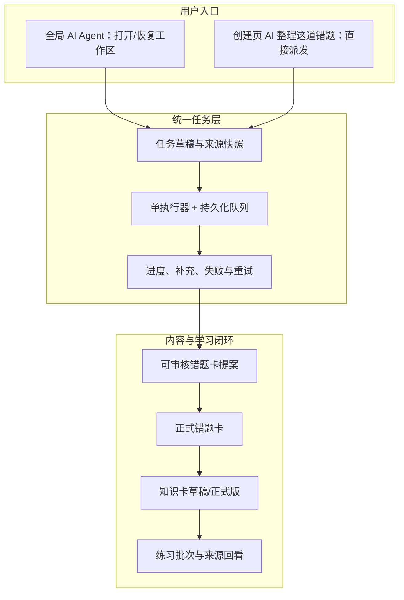

# 知拾 AI 错题学习闭环 PRD

## 文档信息

| 项目 | 内容 |
|---|---|
| 文档版本 | 0.6 |
| 状态 | 方案评审稿 |
| 日期 | 2026-09-05 |
| 产品范围 | 照片采集 → AI 整理错题 → 审核保存 → 知识沉淀 → 练习生成 → 回看复习 |
| 需求来源 | 用户原型走查、现状代码审计、现状使用流程、功能迁移基线 |
| 前置功能台账 | [AI 学习闭环：全流程功能清单](./AI学习闭环-全流程功能清单.md) |
| 交互原型 | [AI Agent 工作流 demo](./demo/ai-agent-workflows/index.html) |
| 产品负责人 | 待指定 |
| 设计、工程、测试评审人 | 待指定 |

### 变更记录

| 版本 | 日期 | 变更 |
|---|---|---|
| 0.1～0.4 | 2026-09-04 | 形成错题、知识卡、练习与 Agent 的早期工作流方案 |
| 0.5 | 2026-09-05 | 删除同屏多个 Agent 呼出入口、独立设置窗和无语义来源勾选框 |
| 0.6 | 2026-09-05 | 从完整学习旅程重写；增加照片直传整理、创建页一键派发、统一任务队列与跨页恢复，并明确其与唯一全局 Agent 入口的关系 |

### 文档关系与权威性

- 本 PRD 描述目标产品行为；详细能力边界与验收编号以[全流程功能清单](./AI学习闭环-全流程功能清单.md)为准。
- [现状使用流程](./功能使用流程.md)用于说明当前能力，不代表所有旧交互继续保留。
- [旧版交互冻结记录](./demo/ai-agent-workflows/contract-freeze.md)可参考数据边界，但其中页面级 Agent 呼出、独立设置窗和来源勾选结论已被本版替代。
- demo 是静态交互样例，不证明桌面真实 Provider、凭据、任务持久化、图片生命周期或正式保存已实现。

### 缺口标记

- 🔶 **假设**：当前没有足够真实使用数据，但为使方案可落地而采用的建议默认值。
- ❓ **待决策**：需要产品负责人、设计或工程在开发前明确的选择。
- 未带标记的规则为本版冻结需求。

## 目录

1. [执行摘要](#1-执行摘要)
2. [问题陈述](#2-问题陈述)
3. [目标用户与任务](#3-目标用户与任务)
4. [战略背景与产品原则](#4-战略背景与产品原则)
5. [解决方案概述](#5-解决方案概述)
6. [成功指标](#6-成功指标)
7. [用户故事与需求](#7-用户故事与需求)
8. [不在本期范围](#8-不在本期范围)
9. [依赖、风险与交付](#9-依赖风险与交付)
10. [待决策问题](#10-待决策问题)

## 1. 执行摘要

### 1.1 一句话方案

让用户拍下做错的题后，可以在创建页一次点击派发 AI 整理任务，或在唯一的全局 Agent 中附图完成同一任务；AI 生成可审核的错题卡提案，用户确认保存后，内容继续进入知识卡和练习闭环。

### 1.2 要解决的问题

当前产品把“打开 Agent”“配置一次生成”“直接开始某项 AI 工作”混在多个按钮中。用户需要先猜应该点击哪个 Agent 按钮，再猜设置窗、Agent 和页面面板分别负责什么。更重要的是，最常见的真实输入——一张错题照片——尚未被定义为一条完整、可恢复、可验收的端到端任务。

### 1.3 方案核心

1. 全应用只保留一个真正的 Agent 呼出入口：右下角 `AI Agent`。
2. 创建错题页增加一个上下文动作：`AI 整理这道错题`。它直接创建并派发任务，不是第二个 Agent 呼出按钮，不打开设置窗。
3. 创建页和 Agent 内附图共用 `organize_mistake` 任务、来源快照、状态机、提案协议和保存边界。
4. 一键派发时自动保存可恢复草稿；执行器忙时自动排队；切页或收起不丢任务。
5. AI 只生成提案。创建页提案应用到草稿后仍需保存；Agent 提案逐张点击保存即构成写操作批准。
6. 普通卡片不显示无说明的勾选框。选择来源使用 `加入任务 / 移出任务`；只有逐字段审核或明确批量管理时才使用选择框。
7. 正式错题继续成为知识卡和练习题的可追溯来源，形成完整学习闭环。

### 1.4 用户价值

- 拍照后不必先理解卡片字段、Agent 模式或设置窗口。
- 一次点击就能把当前材料安全交给 AI，忙时也不会白点或覆盖旧任务。
- 始终知道 AI 正在处理哪道题、读取了哪些图片、结果是否已正式保存。
- AI 失败时原图和草稿仍在，用户可手工完成或配置后重试。
- 错题、知识与练习之间保留来源关系，不把 AI 结果变成孤立文本。

### 1.5 业务结果

🔶 **假设**：减少入口判断和重复配置后，更多用户能完成“照片 → 可审核错题卡 → 正式保存”的首次闭环，并减少重复任务、错误题目边界和未保存误解。

主要结果由“照片错题闭环完成率”衡量，定义见第 6 节。正式目标值需要先采集基线。

### 1.6 本期范围

本期覆盖功能清单中的 86 项能力，重点是：

- 照片选择、预处理、边界说明和临时资产管理；
- 手工草稿与创建页一键派发；
- 唯一全局 Agent、照片输入、任务队列、状态恢复和多卡提案；
- 逐字段审核、保存、revision 冲突与错题库回查；
- 错题到知识卡、练习批次和来源回看的完整链路；
- AI 接入失败恢复、隐私、无障碍和验收证据。

## 2. 问题陈述

### 2.1 谁遇到问题

主要是需要持续整理错题的个人学习者。他们通常在纸质试卷、练习册或手写草稿上完成作答，最自然的输入不是结构化表单，而是手机或电脑中的题目照片。他们愿意检查 AI 结果，但不希望先学习产品内部的 Agent、工具、任务、Provider 和保存机制。

### 2.2 用户正在尝试完成什么

用户真正的任务是：

> “我刚做错一道题，先把照片留下；如果 AI 可用，就帮我整理成以后能复习的错题卡，而且不要替我乱改或弄丢。”

随后用户才会继续：

> “从这些真实错题中总结知识和易错点，再生成练习，练完还能回到原题。”

### 2.3 现有体验的问题

#### 问题 A：三种不同含义的操作都被包装成“呼出 Agent”

原型同时出现页面级 Agent 操作、卡片级 Agent 操作和全局浮动 Agent。它们有时打开设置窗，有时打开对话，有时直接开始任务。控件名称相似，下一步却不同，用户无法形成稳定预期。

#### 问题 B：照片能力存在，但不是一条统一任务

现有创建页能选图、裁剪并使用独立 AI 整理；现有 Agent 也能附图并发起卡片任务。然而两者拥有不同运行状态、生命周期与结果呈现，创建页不能把一次操作可靠地转交给统一 Agent 任务系统。

#### 问题 C：开始任务、应用建议与正式保存容易混淆

“发送给 AI”“接受建议”“批准写操作”“保存草稿”“保存卡片”分别会产生不同副作用。如果界面只显示勾选或笼统的“确认”，用户无法判断数据是否已经写入。

#### 问题 D：长任务缺少统一可见性

错题整理、知识卡生成、练习生成与 Agent 运行各自维护状态。收起、切页、刷新或重启后的行为不一致；当前也没有统一的排队、失败重试和待审核定位方式。

#### 问题 E：错误题目边界会直接污染长期资料

一张照片可能包含多道题，一道题也可能跨多张图。若 AI 擅自合并、拆分或忽略指定小问，生成的错题卡、知识点和后续练习都会建立在错误来源上。

### 2.4 为什么痛苦

| 影响 | 用户后果 | 产品后果 |
|---|---|---|
| 认知成本 | 不知道按哪个按钮、任务是否开始 | 入口点击多但闭环完成率低 |
| 信任 | 不确定 AI 读了什么、是否已保存 | 用户不敢把重要学习资料交给 AI |
| 数据质量 | 多题混卡、错小问、字段被覆盖 | 知识与练习链路被错误来源污染 |
| 恢复成本 | 切页后找不到结果、失败后重新上传 | 重复任务、重复卡和资产垃圾增加 |
| 无障碍 | 裸勾选框、状态只靠颜色或位置 | 键盘和辅助技术用户无法可靠操作 |

### 2.5 证据

#### 已确认事实

- 用户直接反馈“三个呼出 Agent 的按钮逻辑很混乱”。
- 用户指出来源卡上的勾选框意义不明，要求删除。
- 用户补充关键需求：输入错题照片，让 AI 整理成错题卡；既可进入 Agent 完成，也必须能在创建时一键派发任务。
- 当前创建页已有图片导入、旋转/裁剪、草稿暂存和独立 AI 整理能力。
- 当前 Agent 已支持文字、图片附件、卡片引用、运行时间线、取消和写操作批准，但当前实际挂载版本一次只处理一个 `cards.create`，批准卡只展示标题和影响，不能完整审阅题目、解法、错因与知识点。
- 当前创建页 AI 整理与 Agent 是不同前端/运行链路，Agent 会话主要存在内存中，尚无统一持久化任务队列。
- 当前知识卡后台结果保存为待审核草稿，练习生成成功后进入练习库；保存语义本身并不相同，需要界面明确说明。

#### 仍需验证

- 🔶 **假设**：用户更偏好“一键派发后继续做别的事”，而不是先进入 Agent 配置。
- 🔶 **假设**：一道错题任务最多 3 张图能覆盖大多数场景。
- 🔶 **假设**：当执行器忙时自动排队，比弹窗阻止更符合快速采集需求。
- 当前没有真实漏斗基线、任务时长分布或照片多题比例。

## 3. 目标用户与任务

### 3.1 主要用户：个人学习者

| 维度 | 描述 |
|---|---|
| 场景 | 刚做完纸质题、批改后发现错误，或整理已有照片 |
| 能力 | 会拍照、输入文字、检查答案；不理解软件架构或 AI 工具协议 |
| 目标 | 快速记录，准确整理，稍后可找、可学、可练 |
| 顾虑 | 拍糊了、识别错题号、AI 编造错因、覆盖原内容、任务结果丢失 |
| 成功标准 | 能在不理解“Agent 系统”的前提下完成保存并在错题库找到结果 |

### 3.2 次要用户

#### 深度整理者

一次处理多张图片或多道题，愿意在 Agent 中补充题号、拆卡要求和表达方式，并逐张确认提案。

#### 无障碍与键盘用户

依赖清晰标签、可见焦点、键盘顺序和状态播报，不能依靠裸图标、颜色、悬停或拖动完成关键流程。

### 3.3 Jobs-to-Be-Done

- 当我刚发现一道错题时，我想先拍照并一键交给 AI，以便不打断当前学习。
- 当照片包含多页或指定小问时，我想明确题目边界，以便卡片不会串题。
- 当 AI 正在处理时，我想继续编辑或切页，以便不必等待。
- 当 AI 返回结果时，我想看到证据、不确定项和冲突，以便只采纳可信内容。
- 当 AI 或网络失败时，我想保留照片和草稿并知道怎么恢复，以便已经做的工作不丢失。
- 当错题保存后，我想从它沉淀知识和生成练习，以便形成可重复的学习闭环。

## 4. 战略背景与产品原则

### 4.1 产品目标

1. 把最自然的照片输入变成可靠的错题卡生产入口。
2. 用统一任务模型替代多个外观相似、行为不同的 Agent 入口。
3. 保持 AI 可审核、来源可追溯和手工路径可用。
4. 把错题整理与知识、练习串成同一学习闭环，而不是孤立功能。
5. 建立可逐项验收的产品基线，支持后续原型和工程拆分。

### 4.2 非目标

- 不把产品变成通用多 Agent 工作流平台。
- 不追求 AI 无人审核地自动维护所有学习资料。
- 不以增加入口数量来提高某项功能的可发现性。
- 不在本期解决云同步、团队协作或大规模教材扫描。

### 4.3 为什么现在做

- 用户已经在原型阶段发现入口模型无法理解，继续叠加功能会放大混乱。
- 图片处理、错题字段、Agent 图片输入和后台生成基础已经存在，当前适合先统一产品协议，而不是再增加第三套实现。
- 照片错题是完整学习闭环的第一步；入口错误会沿知识卡与练习链路放大。

### 4.4 产品原则

1. **按用户目标命名**：按钮写“AI 整理这道错题”，不写内部概念“部署 Agent”。
2. **入口与任务分离**：打开工作区、创建任务、批准写入是三种不同动作。
3. **一键不等于无反馈**：一键减少配置步骤，但必须立即显示状态、来源和恢复路径。
4. **快照诚实**：请求发送后使用固定快照；之后的编辑不会伪装成已影响运行中请求。
5. **AI 先提案**：错题和知识内容先审核，再成为正式资料。
6. **异常也是主流程**：无配置、网络失败、图片不清、多题、冲突、取消与重启都必须可恢复。
7. **来源贯穿闭环**：知识和练习必须追溯到准确错题及 revision。
8. **手工永不被锁死**：AI 不可用时仍能完成核心记录与编辑。

### 4.5 关键取舍

| 取舍 | 本期选择 | 原因 |
|---|---|---|
| 一个入口 vs. 页面快捷动作 | 保留一个 Agent 呼出入口；仅创建页保留明确的直接任务动作 | 满足拍照一键派发，同时不重建三个 Agent 按钮 |
| 忙时阻止 vs. 自动排队 | 自动创建排队任务 | 一键采集不能因已有任务而丢失 |
| 创建页自动多卡 vs. 先确认 | 检测多题后先确认 | 降低错题边界污染风险 |
| 自动保存正式卡 vs. 人工确认 | AI 只生成提案，用户明确保存 | 学习资料需要可控与可追溯 |
| 多 Agent 并行 vs. 单执行器 | 单执行器 + 最小持久化队列 | 降低状态复杂度并符合当前运行能力 |

## 5. 解决方案概述

### 5.1 用户看到的产品结构



用户不需要理解“统一任务层”。它的作用是保证两个入口不会产生两套状态与结果。

### 5.2 入口模型

#### 全局 Agent 按钮

- 是唯一具有“打开 Agent”语义的控件。
- 无活动任务时打开 Agent 首页；有待处理任务时定位最高优先级项。
- 仅打开不会读取当前页面全文、创建任务或调用模型。
- 收起后显示运行、排队、需补充、待审核或失败徽标。

#### 创建页直接任务动作

- 名称固定为 `AI 整理这道错题`。
- 仅在当前有题目文字或已确认照片时可用。
- 点击后直接暂存并派发，不打开独立设置窗。
- 旁边显示“会读取当前草稿和图片，结果需确认后保存”。
- 直接任务使用照片整理的固定安全策略，不继承用户在普通 Agent 对话中临时选择的“仅聊天”模式。
- 派发成功后提供 `在 Agent 中查看`，用于定位同一任务，不创建新任务。

#### Agent 内任务选择

- `整理错题`、`生成或完善知识卡`、`生成或修改练习`只出现在 Agent 内部。
- 它们是任务类型选择，不是业务页面上的额外呼出按钮。
- 普通对话保持轻量，只有明确建卡意图才转为可检查的任务草稿。

### 5.3 照片输入设计

#### 共同能力

- 支持 PNG、JPG/JPEG、WebP，单张不超过 15MB。
- 派发前按当前 Provider 能力统一校验图片张数和累计大小；现有通用 API 的累计上限为 32MiB，不把后端限制留到调用后才报错。
- 先旋转、裁剪和预览，再成为任务资产。
- 显示图片顺序、删除与重排；拖动有按钮/键盘替代。
- 明确说明“多张图片默认属于同一道题”。
- 可填写题号、小问、我的作答和补充要求。

#### 创建页规则

- 当前页面只代表一张错题卡。
- 多张图默认是一道题的不同部分。
- AI 检测出多道独立题时进入 `needs_input`，询问裁剪、指定题号或是否改在 Agent 中分别成卡。

#### Agent 规则

- 单轮暂定最多 3 张图。
- 用户明确要求分别整理多道题时，最多返回 10 张独立提案。
- 每张提案拥有独立 `proposalId`、资产引用、保存和放弃状态。
- 用户指定题号/小问时只处理指定范围；不确定时先询问。

### 5.4 创建页一键派发协议

一次点击必须被系统视为一个原子业务操作：

1. 校验至少有题目文字或一张已处理图片。
2. 建立或恢复稳定的 `captureDraftId`。
3. 保存当前字段、图片顺序、补充要求和本地草稿状态。
4. 固化不可变 `sourceSnapshot`，记录源字段、资产 ID 和 revision。
5. 生成 `idempotencyKey = draftId + sourceRevision + taskKind`。
6. 创建 `organize_mistake` 任务。
7. 执行器空闲则进入 `running`；忙碌则进入 `queued`。
8. 返回 `taskId` 和状态；页面立即更新并允许用户离开。

如果步骤 2～7 任一步失败，界面不得显示“已派发”。草稿和已处理图片必须保留，用户可重试或前往 AI 接入。

### 5.5 图片所有权与安全移交

图片必须按角色记录，不能把创建页已有图片直接塞进当前 Agent 的临时附件数组：

| 角色 | 含义 | 谁可以清理 |
|---|---|---|
| `borrowed` | 已属于采集草稿或已有卡片，任务只读 | 只有其所属草稿/卡片的明确删除流程 |
| `owned_upload` | 用户直接在 Agent 本轮上传，暂由任务拥有 | 任务结束且没有提案/卡片引用后 |
| `derived` | 为某张提案裁切或复制出的独立资产 | 只由对应提案/卡片生命周期管理 |

- 一键派发成功前，页面草稿保持图片所有权；成功后任务只取得 borrowed 引用。
- 取消、失败、普通回答或拒绝提案不得删除 borrowed 图片。
- 多卡提案不得共享一个会被单卡删除的可变资产；每张卡使用独立派生图/副本，或采用经评审的共享来源模型。
- 所有权转移、写卡与清理都必须幂等；页面卸载回调不能是唯一清理保障。

### 5.6 快照与运行中编辑

- 任务读取的是提交时快照，不是持续变化的表单。
- 派发后用户仍可编辑当前草稿。
- 页面必须提示“AI 正在处理 11:51 的版本；之后的修改尚未发送”。
- 提案返回时，将当前字段与快照对比；用户修改过的字段标记冲突，默认不覆盖。
- 用户可以应用其他无冲突建议，或用最新草稿重新派发新 attempt。

### 5.7 统一任务状态

| 状态 | 用户文案 | 可执行操作 | 是否占用执行器 |
|---|---|---|---|
| `dispatching`（本地瞬时状态） | 正在保存草稿并派发 | 等待；禁止重复提交 | 尚未创建任务 |
| `queued` | 已排队，前方 N 项 | 查看、取消 | 否 |
| `running` | 正在读取图片/分析/校验 | 查看、停止；可离开本页 | 是 |
| `cancel_requested` | 正在停止，尚未完全结束 | 查看 | 直到 Provider 返回或被终止 |
| `needs_input` | 需要确认题号、范围或补图 | 补充、取消 | 否 |
| `waiting_review` | 整理建议待审核 | 打开审核、放弃 | 否 |
| `applying` | 正在应用或保存 | 等待；禁止重复提交 | 短时占用写入锁 |
| `completed` | 已按该任务约定完成 | 打开结果、开始后续任务 | 否 |
| `failed` | 未完成：具体原因 | 重试、配置、手工继续、取消 | 否 |
| `cancelled` | 已取消 | 查看保留内容、重新派发 | 否 |
| `interrupted` | 应用关闭导致中断 | 从快照重试、放弃 | 否 |

`needs_input` 和 `waiting_review` 不阻塞后续排队模型任务。任务转换必须遵守功能清单 `OPS-001` 的状态机。

### 5.8 Agent 任务列表

Agent 内提供最小任务视图，而不是复杂控制台：

- 当前运行任务；
- 已排队任务与顺位；
- 需要补充、待审核和失败任务；
- 最近完成任务及结果链接。

排序优先级为：需补充/待审核 → 失败 → 运行 → 排队 → 最近完成。全局徽标只显示最高优先级状态与数量，避免多个状态同时争抢注意力。

`新对话` 只重置普通聊天上下文，不删除或取消持久化任务、提案和队列。取消任务必须在对应任务上明确操作。

### 5.9 AI 提案与审核

统一提案至少包含：

- `proposalId`、`taskId`、`sourceRevision`；
- 题目、我的答案、正确答案、正确解法、第一处错误、错误原因、错误类型、知识点建议；
- 每个字段的证据来源：图片、用户文字、已有卡片或推断；
- `uncertain`、不确定原因和补充建议；
- warnings 与题目边界判断；
- 多卡任务中的独立资产引用。

审核界面：

- 标题明确写“选择要应用到草稿的建议”。
- 同时显示当前内容、AI 建议、证据、不确定性和冲突。
- 确定项可一键全选；不确定项和冲突项默认不选择。
- 提供逐项选择、`接受所选` 和 `拒绝全部`。
- 这里的选择框语义明确；普通来源卡和内容卡不得使用无说明勾选框。

### 5.10 保存边界

| 场景 | AI 完成后 | 用户最终动作 | 正式副作用 |
|---|---|---|---|
| 创建页整理 | 提案绑定现有采集草稿 | 应用字段 → `保存错题卡` | 创建/更新错题卡 revision |
| Agent 照片建卡 | 一张或多张独立提案 | 每张 `保存这张错题卡` | 每次批准只创建该卡 |
| 完善已有错题 | 逐字段提案 | 应用字段 → 以 expectedRevision 保存 | 更新现有卡，不覆盖新 revision |
| 知识卡生成 | 自动持久化待审核草稿 | `保存知识卡` 或放弃 | 保存正式版；放弃恢复上一正式版 |
| 练习生成 | 先形成批次计划 | 批准计划后生成并校验 | 整批事务写入练习库，可撤销批次 |

### 5.11 错题到知识和练习的闭环

#### 错题库

- 正式错题按更新时间浏览，可搜索题目内容，并按学科、章节、知识点筛选。
- 列表显示草稿/已整理、图片、错因、知识点、错误类型与更新时间。
- 详情能回看原图、完整字段和 revision。

#### 知识卡

- 只从明确的错题来源沉淀，记录来源 ID/revision。
- 用户在 Agent 内用 `加入任务 / 移出任务` 管理来源。
- AI 结果先保存为待审核草稿；新草稿不销毁上一正式版本。
- 来源 revision 改变后旧草稿标记过期并阻止直接保存。

#### 练习

- 来源可为错题、知识卡或二者组合，至少一项。
- 数量、难度、题型和补充要求一次可见；数量至少覆盖每个来源，暂定上限 50。
- 生成前显示批次计划；批准后运行确定性结构与来源校验。
- V1 默认整批通过才事务写入；完成后可查看并撤销该批次。
- 每张练习保存来源错题/知识卡及 revision，并可回看。

### 5.12 错误与恢复

| 错误类型 | 必须保留 | 用户恢复动作 |
|---|---|---|
| AI 未配置/认证失败 | 草稿、图片、任务草稿 | 前往 AI 接入；成功后返回同一任务重试 |
| 网络/限流 | 来源快照、任务记录、失败原因 | 原快照重试，生成新 attempt |
| 图片格式/大小/损坏 | 其他图片与表单 | 更换该图片或移除后继续 |
| 模糊/遮挡/范围不清 | 原图与已识别信息 | 补图、裁剪、指定题号或手工填写 |
| 模型结构解析失败 | 来源快照和原始错误码，不展示不安全原文 | 重试；多次失败转手工 |
| revision 冲突 | 用户当前草稿与 AI 提案 | 重新加载最新正式版后比较或重新派发 |
| 保存失败 | 完整提案、批准状态和资产引用 | 安全重试，不重复建卡 |
| 应用关闭 | 任务和来源快照 | 恢复为 `interrupted`，用户主动重试 |

### 5.13 隐私与无障碍

- 首次向某个外部 Provider 发送照片前，说明发送对象、用途和取消方式。
- 日志默认不记录照片、题目正文、完整提示词或密钥。
- 上传、派发、打开 Agent、查看任务、审核与保存都具有不同且清晰的可访问名称。
- 所有输入有可见标签和帮助文字；错误与状态通过 `role=alert/status` 等方式播报。
- 异步操作期间按钮禁用并显示加载，防止重复提交。
- 关键流程可完全使用键盘；弹窗关闭后焦点回到触发控件。
- 拖动重排必须提供按钮或键盘替代；状态不只靠颜色表达。
- 支持 200% 缩放、合理触控目标、可见焦点和减少动态效果。

### 5.14 发布切片

| 发布 | 目标 | 范围 |
|---|---|---|
| R1 入口统一 | 用户不再猜三个 Agent 按钮 | 唯一启动器、创建页明确动作、去设置窗、去裸勾选框 |
| R2 照片一键整理 | 创建页可一键得到可审核提案 | 照片预处理、草稿 ID、快照、幂等派发、审核与保存 |
| R3 统一任务与 Agent | 两入口共用同一任务生命周期 | 队列、任务列表、补充、跨页/重启恢复、多卡提案 |
| R4 学习闭环 | 错题可安全生成知识与练习 | 知识版本、练习计划/事务/撤销、来源追溯 |
| R5 真实桌面交付 | 真实环境可用且有证据 | Provider、凭据、图片生命周期、异常、无障碍与性能验收 |

## 6. 成功指标

### 6.1 主要指标

#### 照片错题闭环完成率

定义：

```text
在 24 小时内成功保存至少一张正式错题卡的有效照片整理会话数
÷
已成功导入至少一张有效照片并主动开始整理的会话数
```

排除：测试数据、用户在 AI 调用前主动放弃、图片前置校验未通过且从未成功导入的会话。

- 当前基线：未知，R1/R2 上线前先测量。
- 🔶 **建议目标**：上线四周后 ≥ 75%；目标需根据基线和真实照片质量校准。
- 分别观察创建页一键路径与 Agent 路径，不把二者混为单一漏斗。

### 6.2 次要指标

| 指标 | 定义 | 建议目标 |
|---|---|---|
| 入口理解成功率 | 无引导走查中首次选择正确入口并准确说出结果 | 🔶 ≥ 90% |
| 一键派发成功率 | 点击后取得可恢复 `taskId` 的比例 | 🔶 ≥ 99.5% |
| 重复任务率 | 同一幂等键产生多个任务的比例 | 0 |
| 待审核发现率 | 后台完成后用户在 24 小时内打开提案的比例 | 先建基线 |
| 审核到保存转化率 | 打开错题提案后正式保存至少一张的比例 | 先建基线 |
| 题目边界纠错率 | 用户在审核中报告合并/拆分错误的比例 | 持续下降，先建基线 |
| 失败恢复率 | 失败后 24 小时内重试或手工保存成功的比例 | 先建基线 |
| 从错题到复习转化 | 已保存错题在 30 天内进入知识或练习任务的比例 | 先建基线 |

### 6.3 体验与性能指标

- 🔶 派发按钮本地反馈 P95 ≤ 300ms。
- 🔶 Agent 任务列表打开 P95 ≤ 500ms，不含模型调用。
- 所有长任务显示当前阶段、是否可离开和下一步。
- 无引导走查中，把“提案已生成”误认为“正式卡已保存”的人数为 0。
- 无引导走查中，把创建页动作误认为“打开另一个 Agent”的人数为 0。

### 6.4 守护指标

- AI 未经用户明确动作正式覆盖错题/知识内容：0 次。
- revision 冲突中的静默覆盖：0 次。
- 已取得任务 ID 但应用内无法恢复任务记录：0 次。
- 单次批准保存了未选择的其他多卡提案：0 次。
- 用户取消或失败导致仍被引用的照片资产丢失：0 次。
- Agent/Provider 不可用导致手工创建、编辑或保存不可用：0 条核心路径。
- 浏览器模拟结果被记录为桌面真实验收：0 次。

### 6.5 度量方案

允许记录：入口、任务类型、来源数量、图片数量、状态变化、阶段耗时、错误码、补充次数、审核打开、字段采纳数、保存/放弃、批次结果与 token usage。

默认禁止记录：照片内容、题目正文、答案正文、完整提示词、API Key、身份凭据和未经脱敏的模型原始输出。

## 7. 用户故事与需求

### 7.1 Epic 假设

我们相信，为照片错题提供一个明确的一键任务动作，并让它与唯一全局 Agent 共用可恢复任务、审核和保存边界，会让个人学习者更容易完成错题采集与整理，因为他们不必在多个 Agent 入口之间猜测，也不会因切页、失败或重复点击而丢失工作。

我们将通过照片错题闭环完成率、入口理解成功率、重复任务率和静默覆盖次数验证该假设。

### 7.2 Story 1：理解两个入口的不同职责

作为不熟悉 AI 产品结构的学习者，我希望一眼分清“打开 Agent”和“整理当前错题”，以便不用猜按钮。

关联：`BAS-003～004`、`DSP-001`、`AGT-001`

验收条件：

- [ ] 所有主要页面只有一个具有“打开 Agent”语义的全局按钮。
- [ ] 创建页只出现一个明确动作 `AI 整理这道错题`，其说明写明会派发当前草稿任务。
- [ ] 点击创建页动作不会先打开 Agent 或独立设置窗。
- [ ] 卡片详情不显示宽泛的“交给 Agent”按钮。
- [ ] 无引导用户能准确说出两个按钮各自会发生什么。

### 7.3 Story 2：导入并整理照片

作为学习者，我希望在发送前旋转、裁剪和确认错题照片，以便 AI 与最终卡片读取正确范围。

关联：`CAP-001～008`

验收条件：

- [ ] 支持的格式与 15MB 上限在选择前可见。
- [ ] 非法、超限、损坏和读取失败分别提示原因与恢复动作。
- [ ] 取消图片编辑不导入资产，确认后才显示预览。
- [ ] 多图顺序可使用键盘调整，删除不会误删其他图片。
- [ ] 多图附近显示“默认属于同一道题”和题号/小问输入。

### 7.4 Story 3：在创建页一键派发

作为刚拍完错题的学习者，我希望点击一次就把当前照片和草稿交给 AI，以便继续学习而不填写设置窗。

关联：`CARD-005`、`DSP-001～006`

验收条件：

- [ ] 无题目文字且无图片时动作禁用，并说明需要添加什么。
- [ ] 点击后立即显示加载并禁用重复提交。
- [ ] 系统原子保存草稿、来源快照、资产引用、幂等键和任务记录。
- [ ] 空闲时返回“已开始”，忙时返回“已排队（前方 N 项）”。
- [ ] 任何步骤失败时不得显示已派发，且草稿和图片仍在。
- [ ] 从点击到拿到任务 ID 不要求第二次配置或确认。

### 7.5 Story 4：派发后继续编辑或离开

作为学习者，我希望任务运行时仍能修改当前草稿或切换页面，以便不被等待阻塞。

关联：`DSP-006～007`、`OPS-002`、`OPS-009～010`

验收条件：

- [ ] 页面显示任务使用的快照时间/revision。
- [ ] 后续编辑明确标记为“尚未发送”，不改变运行中的请求。
- [ ] 切页、收起 Agent 和返回后恢复同一任务状态。
- [ ] 后台完成不自动导航、不抢焦点。
- [ ] `在 Agent 中查看` 定位同一 taskId，不创建重复任务。

### 7.6 Story 5：执行器忙时仍可采集

作为连续整理多道题的学习者，我希望已有任务运行时新任务也能安全排队，以便拍完就走。

关联：`DSP-008`、`AGT-008`、`OPS-001～003`

验收条件：

- [ ] 同一时间只有一个模型任务为 running。
- [ ] 新任务立即取得 taskId 并显示排队顺位。
- [ ] 需补充或待审核的任务不长期占用执行器。
- [ ] 取消排队项不影响运行项和其他排队项。
- [ ] 连续派发的来源快照、图片和结果不串单。

### 7.7 Story 6：在 Agent 中用照片创建一张卡

作为希望与 AI 对话的学习者，我希望在 Agent 中附图并说明要求，以便生成一张可审核错题卡。

关联：`AGT-001～007`、`REV-001～007`

验收条件：

- [ ] Agent 首页可进入“整理错题”任务草稿。
- [ ] 文字、图片、题号/小问和补充要求在发送前一次可见。
- [ ] 修改任务草稿不调用模型；发送后才创建任务。
- [ ] 普通“解释这道题”不自动产生写卡任务。
- [ ] 运行时间线显示图片读取、分析、校验、失败和完成。
- [ ] 运行中可停止，停止不产生正式卡。

### 7.8 Story 7：明确地处理多道题

作为一次上传多道题的学习者，我希望 AI 按题返回独立提案，以便分别决定保存哪些卡。

关联：`AGT-002～003`、`REV-008`、`LIB-001～002`

验收条件：

- [ ] 只有用户明确要求分别成卡时才进入多卡模式。
- [ ] 单次最多 10 张，超出时先要求缩小范围。
- [ ] 每张提案有独立 proposalId、图片资产、保存和放弃状态。
- [ ] 保存一张不会保存或删除其他提案。
- [ ] 用户指定题号/小问时不混入相邻题目。

### 7.9 Story 8：在边界不清时补充信息

作为担心 AI 串题的学习者，我希望系统在不确定时先问我，以便避免错误卡片进入资料库。

关联：`CAP-006～007`、`REV-005`、`OPS-004`

验收条件：

- [ ] 检测到多题、缺题干、模糊或遮挡时进入 `needs_input`。
- [ ] 问题具体说明需要裁剪、补图、指定题号还是确认拆卡。
- [ ] 原图、已识别字段和任务历史保留。
- [ ] 用户补充后产生新任务 revision 并重新排队。
- [ ] 未得到确认前不创建正式卡。

### 7.10 Story 9：审核并选择性应用 AI 建议

作为对资料准确性负责的学习者，我希望逐项对比 AI 建议和我的内容，以便只采纳可信部分。

关联：`REV-001～007`

验收条件：

- [ ] 审核同时展示当前值、建议值、证据、不确定性和 warnings。
- [ ] 运行期间用户改过的字段显示冲突且默认保留用户值。
- [ ] 不确定字段默认不选中，并说明原因和补充办法。
- [ ] 选择区明确写明“应用到草稿”，不显示无说明勾选框。
- [ ] 接受所选只修改草稿，不自动正式保存。
- [ ] 拒绝全部不修改草稿或正式卡。

### 7.11 Story 10：明确保存为正式错题卡

作为学习者，我希望清楚知道哪一步会真正保存，以便不会误以为提案已经入库。

关联：`CARD-006～008`、`LIB-001～007`

验收条件：

- [ ] 创建页只有点击 `保存错题卡` 才创建/更新正式 revision。
- [ ] Agent 中 `保存这张错题卡` 明确显示将创建的对象和图片数量。
- [ ] 写入期间禁用重复点击；重试不得创建重复卡。
- [ ] 保存成功显示卡片链接，并能在错题库检索到。
- [ ] 保存失败保留提案和资产引用，允许安全重试。
- [ ] revision 冲突拒绝覆盖并保留当前草稿。

### 7.12 Story 11：恢复任务与待办

作为会频繁切页或稍后继续的学习者，我希望随时找到运行、失败和待审核任务，以便不丢工作。

关联：`BAS-004`、`AGT-006～009`、`OPS-001～010`

验收条件：

- [ ] 全局徽标显示最高优先级待办及数量。
- [ ] Agent 任务列表可定位需补充、待审核、失败、运行和排队项。
- [ ] 应用内导航后恢复完整任务状态和结果引用。
- [ ] 重启后无法续接的 running 任务显示 `interrupted`，不永久显示运行中。
- [ ] 重试复用原快照并产生新 attempt，不重复写入完成结果。
- [ ] 新对话只重置普通聊天上下文，活动、排队和待审核任务仍保留在任务列表；取消必须逐任务明确操作。

### 7.13 Story 12：从错题沉淀知识卡

作为学习者，我希望从明确错题来源生成知识总结，以便把个别错误沉淀成可复用方法。

关联：`KNOW-001～006`

验收条件：

- [ ] 来源卡使用 `加入任务 / 移出任务`，普通列表不显示裸勾选框。
- [ ] 每个来源记录 cardId 和 revision，可返回原卡。
- [ ] AI 结果先保存为待审核草稿。
- [ ] 新草稿不销毁上一正式版本；放弃后恢复上一版本。
- [ ] 来源 revision 变化后草稿过期并阻止直接保存。

### 7.14 Story 13：生成可追溯练习批次

作为学习者，我希望基于真实错题和知识生成一组练习，以便验证自己是否真正掌握。

关联：`PRAC-001～008`

验收条件：

- [ ] 来源、难度、数量和补充要求一次可见。
- [ ] 数量至少覆盖每个来源且不超过冻结上限。
- [ ] 生成前展示批次计划、写入位置和影响，用户批准后才运行。
- [ ] 结构、来源和 revision 校验全部通过后才事务写入。
- [ ] 保存数量与界面结果一致；失败有逐项明细。
- [ ] 批次可撤销；练习可回看准确来源及 revision。
- [ ] 只有进入批量管理模式后才出现含义明确的选择框和工具栏。

### 7.15 Story 14：AI 配置失败后回到原任务

作为尚未配置 AI 的学习者，我希望完成配置后回到刚才的照片任务，以便不用重新上传和填写。

关联：`DSP-009`、`OPS-005～006`、`GOV-001～002`

验收条件：

- [ ] 认证/配置错误保留草稿、图片、来源快照和 taskId。
- [ ] 错误提供 `前往 AI 接入` 和手工继续选项。
- [ ] 配置成功返回原任务，而非固定首页。
- [ ] 重试使用用户当前选择的 Provider，并再次确认首次图片发送隐私说明。
- [ ] 浏览器预览不展示为真实 AI 成功。

### 7.16 Story 15：无障碍完成完整流程

作为键盘或辅助技术用户，我希望无需鼠标和猜测图标就能完成任务，以便独立使用产品。

关联：`GOV-003～008`

验收条件：

- [ ] 上传、裁剪、重排、派发、打开 Agent、审核和保存均可键盘完成。
- [ ] 每个控件有可访问名称；输入有可见标签和关联帮助。
- [ ] 状态和错误被播报，但后台进度不反复抢焦点。
- [ ] 弹窗焦点受控，关闭后回到触发控件。
- [ ] 200% 缩放下无关键内容遮挡，状态不只靠颜色表达。
- [ ] 减少动态效果时无非必要动画。

### 7.17 功能优先级

| 优先级 | 必须交付的能力 |
|---|---|
| P0 | 入口语义、照片导入、草稿与资产安全、一键派发、幂等、统一任务状态、审核、保存、revision、错误恢复、隐私与手工路径 |
| P1 | 持久化队列、Agent 任务列表、跨页/重启恢复、多卡提案、知识版本、练习事务与撤销、完整无障碍 |
| P2 | 相机直拍优化、系统通知、更多排序/筛选与高级任务管理 |

### 7.18 约束与边界场景

| 场景 | 冻结行为 |
|---|---|
| 同一草稿连续双击派发 | 只产生一个任务，第二次返回同一 taskId |
| 任务运行时修改草稿 | 运行使用旧快照；新修改显示未发送，审核时做冲突对比 |
| 已有任务运行时再次派发 | 新任务排队，不覆盖、不丢弃、不并行调用模型 |
| 一张图中出现两道题 | 创建页先请求确认；Agent 只有明确要求才拆为多卡 |
| 多张图属于同一道题 | 按用户顺序作为一个来源组处理 |
| 无“我的答案” | 可整理题目、答案与解法，但不得编造第一处错误 |
| AI 输出空字段或非法 Schema | 不进入可保存提案，显示解析/校验失败并可重试 |
| 保存时来源 revision 已变 | 阻止覆盖，保留草稿/提案并要求重新对比 |
| 取消排队/运行/审核 | 分别停止对应阶段，只清理无人引用的临时资产 |
| 应用关闭 | 不承诺后台继续；重启恢复记录，未完成请求标为 interrupted |
| Provider 切换 | 已运行任务保持原 Provider 记录；新 attempt 使用当前 Provider |
| 来源卡被删除 | 知识/练习保留不可用来源说明，不显示失效链接 |
| 浏览器预览 | 只模拟，不接收真实密钥或宣称桌面链路已通过 |

### 7.19 非功能需求

- 任务、提案和正式保存必须具备幂等键或唯一约束。
- 所有 AI 输入和输出在前后端执行类型、长度、Schema 与路径校验。
- 临时资产通过引用计数或明确所有权清理，不能依赖页面卸载回调作为唯一保障。
- 页面订阅任务状态，任务执行与持久化不由组件生命周期拥有。
- 日志事件带 taskId/attempt/errorCode，但不含敏感正文。
- 关键状态变化具备可测试的确定性迁移，迟到事件不能覆盖取消/新 attempt。
- 桌面和浏览器服务实现遵守相同界面，但验收证据必须分开。

## 8. 不在本期范围

### 8.1 本期明确不做

- 多个 Agent 同时执行、Agent 间委派、依赖图、人工调度优先级和团队任务分配。
- 云账号同步、跨设备续跑、多人共享、教师批改和班级管理。
- 自动扫描整本试卷或无限批量建卡。
- AI 未经审核自动替换正式错题卡或知识卡。
- 普通聊天自动触发不可撤销写入。
- 复杂 OCR 文本编辑器；用户审核的是结构化字段而非逐字符 OCR 校对工具。
- 以浏览器 demo 证明真实 AI、凭据、本地文件和 Tauri 写入成功。

### 8.2 未来考虑

- 相机连续拍摄、自动透视校正与图片质量评分。
- 系统级完成通知与跨设备同步。
- 任务优先级调整和更丰富的历史检索。
- 大批量试卷切题，但必须先建立可靠的题目边界评估。
- 复习效果与间隔重复调度。

## 9. 依赖、风险与交付

### 9.1 当前基础与主要缺口

| 范围 | 当前基础 | 主要缺口 |
|---|---|---|
| 创建/编辑 | 图片、字段、自动暂存、revision、AI 字段审核 | 稳定采集草稿 ID、原子一键派发、统一任务绑定 |
| 图片 | 类型/单张大小校验、旋转、裁剪、资产导入 | 三类资产角色、多图顺序、累计大小预检、跨重启清理与隐私确认 |
| Agent | 图片附件、引用、时间线、取消、单卡写批准 | 持久化会话/任务、队列、任务定位、完整字段审核与多卡 artifact |
| AI 运行 | 错题整理和后台知识/练习状态存储已有基础 | 多条运行链路尚未统一；应用重启恢复不足 |
| 卡片保存 | 草稿/正式、expectedRevision、来源 revision | Agent 提案和创建页草稿的统一幂等写入 |
| 知识/练习 | 知识草稿、练习库和来源关系已有基础 | 知识上一正式版回滚、练习批次计划/撤销 |

### 9.2 依赖

1. **产品决策**：第 10 节 P0 问题在 R2 开发前冻结。
2. **任务存储**：需要桌面端可持久化的 AgentTask、attempt、状态和结果引用。
3. **统一运行接口**：创建页和 Agent 必须调用同一任务服务，而不是分别调用组织服务和对话运行时。
4. **资产服务**：支持采集草稿、任务、提案和正式卡之间的 `borrowed / owned_upload / derived` 角色、所有权转移与安全清理。
5. **统一提案协议**：Schema、Rust 解析、前端类型、提示词和校验器同步版本化。
6. **Provider 能力**：当前 Provider 必须支持图片输入；不支持时在派发前明确阻止。
7. **卡片数据契约**：继续支持 expectedRevision、知识来源 revision 和练习来源 revision。
8. **设计与研究**：R1 原型需要至少覆盖新手、连续拍多题和键盘用户三类走查。
9. **度量**：先定义不含正文的事件字典，再采集漏斗基线。

### 9.3 风险与缓解

| 风险 | 可能性/影响 | 缓解 |
|---|---|---|
| “一键动作”再次被理解为第二个 Agent | 中/高 | 按用户目标命名；点击直接派发；不使用 Agent 图标/文案；走查入口理解 |
| 创建页与 Agent 继续分叉实现 | 中/高 | 同一 task kind、Schema、store 和验收故事；禁止复制运行逻辑 |
| 自动排队增加隐藏复杂度 | 中/中 | 仅串行队列；显示顺位；需补充/审核不占执行器；不开放复杂调度 |
| 图片资产泄漏或误删 | 中/高 | 明确所有权、引用关系、幂等清理和多提案隔离测试 |
| AI 错误拆题污染资料 | 中/高 | 创建页多题先确认；题号/小问显式输入；边界错误作为守护指标 |
| 用户把提案当正式保存 | 中/高 | 状态文案、结果落点和按钮动词严格区分；走查误解率必须为 0 |
| 切页/重启出现幽灵任务 | 中/高 | 持久化状态；启动时 reconcile；无法续接转 interrupted |
| 保存重试产生重复卡 | 低/高 | task/proposal 幂等键、数据库唯一约束和重复回放测试 |
| Provider 不支持图片 | 中/中 | 派发前能力检查；保留草稿；引导切换 Provider 或手工整理 |
| 指标泄露学习内容 | 低/高 | 事件白名单、正文禁采、日志审计和脱敏测试 |
| 无障碍在最后才补 | 中/中 | Story 15 与每个发布切片共同验收，不设独立“以后再做”阶段 |

### 9.4 专业团队工作方式

#### 阶段 1：需求与现状基线

- 冻结本 PRD 与 86 项功能台账。
- 给每个功能标注现有、需调整、需新增及数据副作用。
- 对第 10 节 P0 决策记录负责人和日期。

#### 阶段 2：旅程与原型

- 先画 J-01～J-09 的正常、失败和恢复流程，再画页面。
- 用可点击原型验证“全局 Agent / 一键派发 / 保存”的理解。
- 删除普通卡片的裸勾选框；审核与批量选择必须明确说明目的。

#### 阶段 3：技术设计与拆分

- 先定义 AgentTask、SourceSnapshot、Proposal、资产所有权和状态迁移。
- 用纵向发布切片交付可独立使用的端到端价值，不按“前端全部做完再做后端”拆分。
- 每个工程任务引用功能 ID、用户故事和验收条件。

#### 阶段 4：实现与验证

- 单元/契约测试：状态机、Schema、幂等、revision、资产清理、批次事务。
- 组件测试：按钮状态、标签、错误、焦点、键盘、重复提交。
- 集成测试：创建页与 Agent 产生相同协议；跨页恢复；配置后返回。
- 桌面实机：真实 Provider、凭据、图片、停止、排队、重启、保存和删除。
- demo 静态走查与桌面真实验收分别记录，不互相替代。

#### 阶段 5：发布与观察

- 先内部样本和小范围使用，再逐步开放。
- 监控完成率、失败类型、待审核积压、重复任务和题目边界纠错。
- 保留失败与负面证据；达不到守护指标时停止扩大范围。

#### 团队职责

| 角色 | 主要责任 | 必须交付的证据 |
|---|---|---|
| 产品负责人 | 冻结用户问题、范围、优先级、指标与 OQ 决策 | 已批准 PRD、决策记录、发布门槛 |
| 产品设计 | 用户旅程、信息架构、原型、状态与无障碍设计 | 正常/异常原型、无引导走查记录 |
| 前端工程 | 页面交互、任务订阅、审核、焦点与状态反馈 | 组件/集成测试、浏览器与桌面界面证据 |
| 后端/Tauri 工程 | 任务状态机、持久化、Provider、幂等、资产和事务 | 契约/存储测试、重启与失败恢复证据 |
| 测试 | 从功能 ID 建立正常、异常与回归矩阵 | J-01～J-09 结果及缺陷闭环 |
| 隐私/安全评审 | 图片外发、凭据、日志和不可信 AI 输出边界 | 数据流与日志审计结论 |
| 用户代表 | 用真实照片样本验证理解、边界和结果质量 | 样本集、可用性反馈、未通过案例 |

### 9.5 测试与验收矩阵

| 层级 | 重点 |
|---|---|
| 领域/后端 | 状态迁移、幂等、唯一约束、revision、Schema、批次事务、资产引用 |
| 前端组件 | 输入标签、按钮禁用/加载、明确选择语义、错误播报、焦点恢复 |
| 前后端契约 | 两入口统一请求/提案、事件字段、取消与迟到事件、错误码 |
| 端到端 | J-01～J-09，含正常、失败、取消、切页、重启和配置返回 |
| 桌面实机 | 真实图片发送、Provider、凭据库、文件生命周期和正式写入 |
| 无障碍 | 纯键盘、屏幕阅读器、200% 缩放、对比度、减少动态效果 |
| 度量审计 | 事件完整但无题目正文、图片、提示词或密钥 |

### 9.6 发布门槛

- P0 功能 ID 全部映射到代码、测试和验收证据。
- 两条照片主流程均能完成正式保存。
- 重复任务、静默覆盖、跨提案误保存和错误资产删除均为 0。
- 入口理解走查达到冻结目标，且无人将“提案完成”误认为“卡片已保存”。
- 手工路径在 AI 未配置、网络失败和 Provider 不支持图片时仍可完成。
- 桌面真实能力有独立证据；未验证项明确标注，不得用 demo 截图替代。

## 10. 待决策问题

### 10.1 开发前必须冻结（P0）

| ID | 问题 | 本版建议默认 | 决策人/截止 |
|---|---|---|---|
| OQ-01 | 单任务图片上限是否为 3 张？ | 先采用 3 张，用真实错题样本验证 | 产品 + 工程 / R2 前 |
| OQ-02 | 应用重启后是否自动续跑远端请求？ | 不自动续接；恢复为 interrupted，由用户重试 | 产品 + 工程 / R3 前 |
| OQ-03 | 练习批次允许部分成功写入吗？ | 不允许；V1 整批校验通过才事务写入 | 产品 / R4 前 |
| OQ-04 | 知识卡放弃新草稿时是否必须恢复上一正式版？ | 必须恢复，不删除上一版 | 产品 + 数据 / R4 前 |
| OQ-05 | 首次照片外发隐私确认按应用还是按 Provider？ | 按 Provider 首次确认 | 产品 + 隐私 / R2 前 |

### 10.2 可通过原型或数据验证（P1）

| ID | 问题 | 验证方式 |
|---|---|---|
| OQ-06 | “AI 整理这道错题”是否是最易懂名称？ | 与“整理照片”“生成错题卡”做无引导理解测试 |
| OQ-07 | 忙时自动排队是否让用户安心？ | 连续派发三题的任务走查与取消测试 |
| OQ-08 | 多题检测应在哪个置信度请求确认？ | 建立真实多题/多页样本集，先以宁可多问为原则 |
| OQ-09 | 待审核徽标是否足够，是否需要系统通知？ | 观察 24 小时待审核发现率；V1 暂不做系统通知 |
| OQ-10 | 创建页是否需要直接查看任务时间线？ | 原型比较“简短状态 + 在 Agent 中查看”与内嵌时间线 |

## PRD 自评

### 最强部分

入口、任务和保存三种动作被明确分开，并用同一任务协议连接创建页与 Agent；功能 ID、状态、副作用、异常恢复和发布门槛均可直接转成原型、工程任务与验收用例。

### 最弱部分

目前缺少真实用户行为数据、照片样本分布和桌面实机任务时长，成功指标目标值与图片上限仍是待验证假设。

### 最需要验证的假设

1. 用户更喜欢创建页一次点击派发，而不是先进入 Agent。
2. 自动排队能降低采集打断，且不会让用户失去控制感。
3. 单任务 3 张照片足以覆盖多数一道题/一个小问。
4. 多题先确认的额外一步能显著降低串题，而不会造成过多打断。
5. 应用内任务徽标足以让用户找回待审核结果。

### 推荐的下一步

先更新静态 demo，只验证三件事：

1. 用户能否分清 `AI Agent` 与 `AI 整理这道错题`；
2. 一键派发后的开始、排队、需补充、待审核和失败状态是否可理解；
3. 审核选择与正式保存是否不会被混淆。

通过无引导走查并冻结 OQ-01～OQ-05 后，再进入任务存储、统一运行接口与资产所有权的技术设计。

## 附录 A：功能台账覆盖

| 功能组 | 数量 | PRD 主要落点 |
|---|---:|---|
| BAS 基础与导航 | 5 | 5.2、Story 1、Story 11 |
| CAP 照片采集 | 8 | 5.3、Story 2、Story 8 |
| CARD 草稿与编辑 | 8 | 5.4～5.6、Story 3～4、Story 10 |
| DSP 一键派发 | 9 | 5.2、5.4、Story 3～5、Story 14 |
| AGT Agent 工作区 | 9 | 5.2、5.7～5.8、Story 6～7、Story 11 |
| REV 提案审核 | 8 | 5.9～5.10、Story 7～10 |
| LIB 保存与错题库 | 7 | 5.10～5.11、Story 10 |
| KNOW 知识卡 | 6 | 5.11、Story 12 |
| PRAC 练习 | 8 | 5.11、Story 13 |
| OPS 任务与恢复 | 10 | 5.4、5.7～5.8、5.12、Story 4～5、Story 11、Story 14 |
| GOV 安全与无障碍 | 8 | 5.13、6.5、Story 14～15 |
| **总计** | **86** | 全部进入本 PRD；详细验收仍以功能台账为准 |
