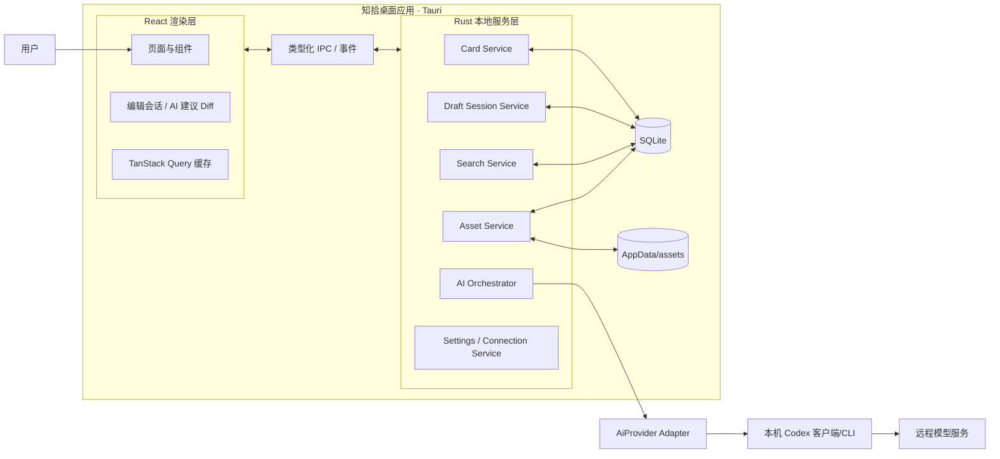
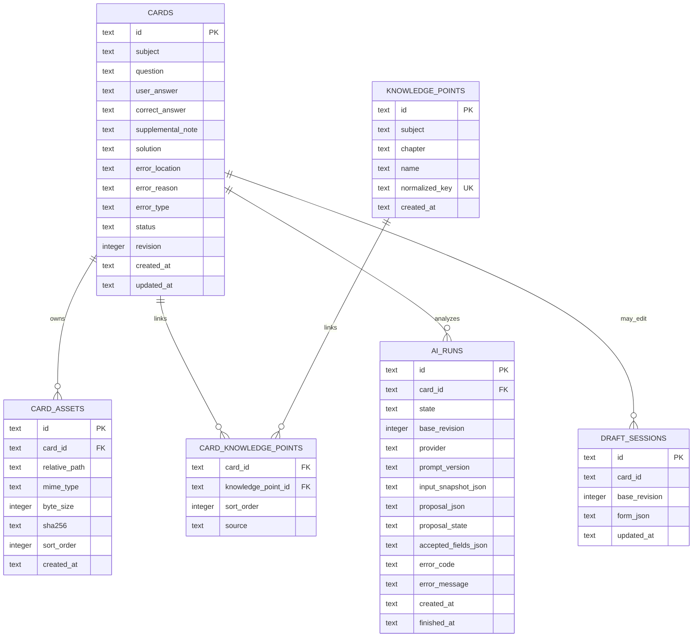
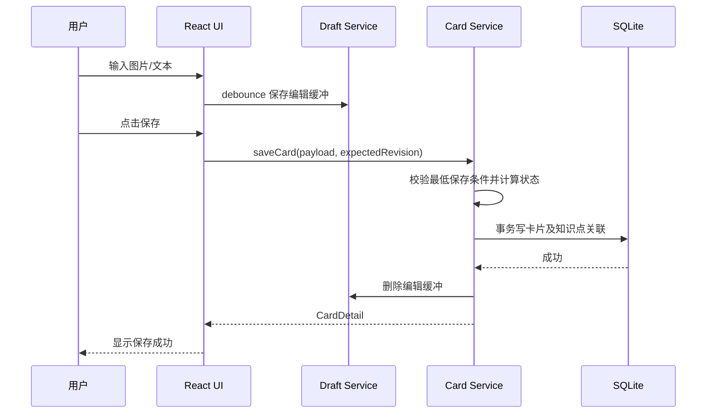
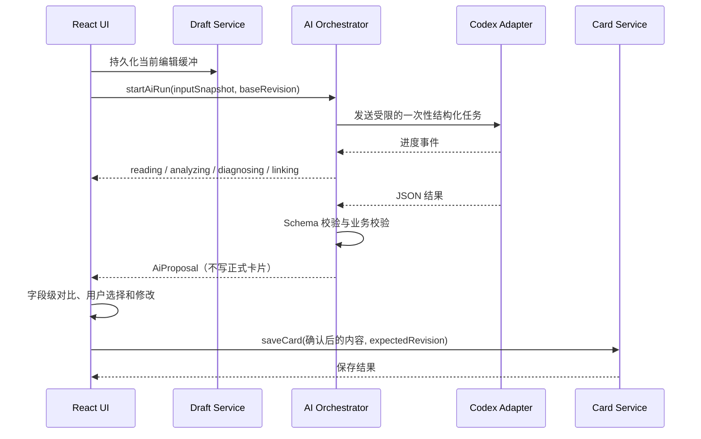

# 知拾 MVP 架构设计与技术栈选型

> 输入依据：`产品设计书.md`、`index.html` Demo  
> 目标版本：MVP 1.0  
> 架构结论：**本地优先的桌面端模块化单体，手动能力为核心，Codex 作为可拔插的异步增强模块。**

---

## 1. 结论先行

### 1.1 推荐方案

采用以下组合：

- **桌面容器**：Tauri 2
- **前端**：React + TypeScript + Vite
- **本地服务层**：Rust/Tauri Commands
- **数据存储**：SQLite
- **图片存储**：应用数据目录中的文件，SQLite 只保存相对路径和元数据
- **AI 接入**：`AiProvider` 适配器 + 本机 Codex 客户端/CLI，一次性结构化任务，不让 AI 直接写库
- **通信方式**：前端通过类型化 IPC 调用本地服务；AI 进度通过事件推送
- **应用形态**：单进程桌面模块化单体，不建设远程后端、账号系统或微服务

### 1.2 为什么适合本产品

1. 产品明确“个人安装、无需登录、桌面端优先”，本地数据库比云服务更匹配。
2. 不连接 Codex 时必须完整可用，因此数据层、搜索、编辑均不能依赖网络。
3. Tauri 安装包和运行占用通常小于 Electron，并能安全访问 SQLite、文件系统和本地进程。
4. AI 通过适配器隔离，Codex 不可用、认证失效或未来更换调用方式时，不影响手动功能。
5. SQLite 足以覆盖个人错题库的容量、筛选和事务需求，无需部署数据库服务。

### 1.3 不建议的方案

- **纯网页 + LocalStorage**：图片、迁移、备份、并发写入和结构化检索能力不足。
- **MVP 即建设云后端**：与“无账号、无云同步”的范围冲突，增加部署、隐私和运维成本。
- **微服务/多 Agent/RAG/向量数据库**：产品设计书已明确排除，属于过度设计。
- **让 AI 直接修改卡片表**：违反“生成与保存分离”“手动内容优先”。

---

## 2. 从设计书和 Demo 提炼的架构约束

### 2.1 核心业务约束

- 打开应用直接进入错题主页，不存在登录前置流程。
- 图片或题目文本任一存在即可保存。
- 卡片允许不完整，并在“待完善”和“已整理”之间转换。
- 搜索范围至少包括题目、诊断和知识点。
- 知识点采用固定三级表达：学科 → 章节 → 知识点。
- AI 只由用户主动触发；失败、取消、连接过程不能丢失输入。
- AI 结果先进入建议态，必须由用户逐项确认后才能保存。
- AI 重新整理不得静默覆盖用户已经修改的字段。

### 2.2 非功能约束

- **离线可用**：除 AI 外，所有功能均在无网络环境运行。
- **本地隐私**：卡片、图片和诊断默认只保存在本机。
- **可靠性**：异常退出后应能恢复最近编辑缓冲；数据库升级前应备份。
- **可替换性**：Codex 调用方式、认证方式不应渗透到卡片领域模型。
- **可维护性**：MVP 保持模块化单体，避免不必要的分布式复杂度。

### 2.3 当前 Demo 与正式产品的差距

`index.html` 已验证主页、抽屉编辑、详情、筛选、模拟连接和模拟 AI 流程，但仍是展示原型：

- 卡片只保存在 JavaScript 内存，重启即丢失。
- 图片以 Data URL 暂存在页面内，且 `uploadedImage` 没有进入 `collectEditor()`，当前“仅图片保存”实际不能可靠恢复。
- AI 和连接过程由定时器模拟，并直接给表单字段赋值，不具备真正的建议 Diff 和逐项确认。
- 搜索尚未覆盖正确解法、错误位置和答案；知识点仍是无层级自由字符串。
- 状态判断、数据校验和错误恢复尚未形成统一领域规则。
- 没有数据库迁移、版本冲突、进程取消、隐私边界和自动化测试。

正式实现应保留 Demo 的交互和视觉语言，但替换其数据、AI、文件和状态管理方式。

---

## 3. 总体架构



### 3.1 分层职责

#### 表现层

- 页面、抽屉、表单、筛选、进度、错误提示和 AI 建议对比。
- 不直接执行 SQL，不直接启动本地进程。
- 不把 TanStack Query 缓存当作最终数据源。

#### 应用层

- 编排“新建卡片、保存草稿、执行 AI、接受建议、删除卡片”等用例。
- 控制事务、状态转换和乐观并发版本。
- 将 Codex 输出转换为领域可接受的建议对象。

#### 领域层

- 定义卡片完整性、错误类型、知识点层级、AI 建议状态等规则。
- 核心规则保持纯函数，便于单元测试。

#### 基础设施层

- SQLite、图片文件、本地进程、Codex 认证探测、日志和配置。
- 通过接口被应用层调用，不能反向污染领域模型。

---

## 4. 模块边界

| 模块 | 主要职责 | 不应承担的职责 |
|---|---|---|
| Card | 卡片 CRUD、完整性判断、版本控制 | 调用 Codex、处理图片二进制 |
| Draft Session | 保存当前编辑缓冲、异常恢复、离开保护 | 成为正式卡片数据源 |
| Knowledge Point | 三级知识点维护、去重、卡片关联 | 知识图谱和学习统计 |
| Asset | 图片校验、复制、缩略图、删除引用 | 把大图 Blob 存进卡片表 |
| Search | 关键词、状态、知识点组合筛选 | 语义搜索、向量检索 |
| AI Orchestrator | 任务状态、输入快照、结构校验、取消、重试 | 直接覆盖正式卡片 |
| Codex Adapter | 连接探测、任务调用、流式事件转换 | 包含业务状态判断 |
| Settings | 本机设置、Codex 可用状态、数据目录信息 | 存储卡片内容 |

---

## 5. 关键领域规则

### 5.1 卡片状态只由内容计算

前端不得自行决定状态。统一使用领域函数计算并在保存事务中落库：

```text
若缺少题目文本                    → 待完善
若没有任何知识点                  → 待完善
若存在用户答案但缺少错因诊断       → 待完善
若不存在用户答案且缺少正确解法      → 待完善
其余                              → 已整理
```

其中“错因诊断”至少要求错误位置或错误原因，并具有一个固定错误类型；缺少作答过程时允许通过“正确解法 + 知识点”达到已整理状态。

### 5.2 AI 不能写正式卡片

AI 输出只能形成 `AiProposal`：

```ts
type AiProposal = {
  runId: string;
  baseRevision: number;
  promptVersion: string;
  fields: {
    question?: ProposedField<string>;
    userAnswer?: ProposedField<string>;
    correctAnswer?: ProposedField<string>;
    solution?: ProposedField<string>;
    errorLocation?: ProposedField<string>;
    errorReason?: ProposedField<string>;
    errorType?: ProposedField<ErrorType>;
    knowledgePoints?: ProposedField<KnowledgePointInput[]>;
  };
  warnings: string[];
};

type ProposedField<T> = {
  value: T | null;
  uncertain: boolean;
  uncertainReason?: string;
  source: "image" | "user_text" | "inference";
};
```

确认规则：

1. 开始 AI 任务时记录编辑内容快照和 `baseRevision`。
2. AI 返回后只显示“原值 → 建议值”的字段级差异。
3. 用户选择接受哪些字段；仅空字段且未标记不确定的建议可以默认选中，已有手动值的替换默认不选中。
4. 不依赖模型自报的数值置信度自动接受结果；不确定内容必须给出原因。
5. 若 AI 运行期间用户修改了某字段，该字段标记冲突，禁止自动应用。
6. 用户点击保存后，才通过正常的 `save_card` 用例写入数据库。

### 5.3 乐观并发

即使是单用户桌面应用，也存在“AI 返回时用户仍在编辑”的并发：

- `cards.revision` 每次保存加一。
- 保存请求携带 `expectedRevision`。
- 版本不一致时返回 `REVISION_CONFLICT`，由 UI 展示字段差异。

---

## 6. 数据设计

### 6.1 SQLite 表



### 6.2 设计说明

- 主键使用 UUID/ULID，不使用时间戳作为业务 ID。
- 时间统一保存 UTC ISO 8601，展示时转换为本地时间。
- `error_type` 仅允许产品设计书规定的固定枚举。
- 知识点按“学科 + 章节 + 名称”规范化去重；MVP 不建通用树结构。手工草稿允许章节暂缺，UI 统一显示为“未分类章节”，AI 建议仍应返回完整三级结构。
- 新建卡片尚未正式保存时，`ai_runs.card_id` 允许为空，并通过编辑会话关联；AI 运行状态不得混入卡片状态。
- `proposal_state` 记录 `pending/partially_accepted/accepted/rejected/superseded`，不为每个字段额外建设复杂审计表。
- 图片保存在应用数据目录，例如 `assets/{cardId}/{assetId}.webp`，数据库不保存大 Blob。
- 删除卡片时，数据库关联和图片文件采用“事务记录 + 事务后清理”；失败文件进入待清理队列，避免数据库回滚不了文件系统操作。
- 启用 `foreign_keys`、WAL 和 `busy_timeout`；数据库迁移前自动创建备份。

### 6.3 搜索策略

MVP 数据量预计为几百到几千张卡片，先采用参数化 SQL：

- 题目、正确解法、错误位置、错误原因使用 `LIKE` 子串匹配。
- 知识点通过关联表精确筛选，并可叠加状态条件。
- 输入端做 200～300ms debounce。
- 给 `status`、`updated_at` 和知识点关联键建立索引。

暂不引入 Elasticsearch、向量数据库或中文分词服务。若实测达到万级卡片后搜索延迟明显，再评估 SQLite FTS5 trigram/中文分词扩展。

---

## 7. 关键流程设计

### 7.1 手动保存



### 7.2 AI 整理



### 7.3 连接状态

连接状态是运行时能力状态，不是业务账号状态：

```text
disconnected → checking → connected
                      ├→ expired
                      └→ unavailable
```

- 应用优先让 Codex 官方客户端拥有认证凭据，不复制、不明文保存令牌。
- 每次真正执行前再做轻量可用性检查，不能只相信启动时状态。
- 连接失败只影响 AI 按钮，不能阻断卡片编辑和保存。

---

## 8. Codex 接入设计

### 8.1 接口隔离

```rust
trait AiProvider {
    fn probe(&self) -> ProviderStatus;
    fn start(&self, request: AnalyzeRequest) -> RunHandle;
    fn cancel(&self, run_id: &str) -> Result<()>;
}
```

业务层只认识 `AiProvider`，不依赖具体 CLI 参数、认证文件或模型名称。

### 8.2 推荐的 MVP 调用方式

- 由 Rust 后端启动本机 Codex 客户端/CLI 子进程。
- 使用一次性、非交互、可取消的结构化任务。
- 解析机器可读事件；只有底层确实提供阶段信息时才映射为四阶段，否则使用不伪造百分比的“不确定进度 + 当前动作”提示。
- 对最终输出执行 JSON Schema/Zod 等价校验和领域枚举校验。
- 固定并记录 `promptVersion`，便于定位结果回归。
- 将待分析图片复制到本次任务专用临时目录，只开放必要的只读输入。
- 不赋予 AI 执行任意命令、写工作区或访问整个用户目录的权限。

> Codex 的具体认证、图片输入、结构化输出和非交互调用能力应在正式开发前做 1～2 天技术验证。若目标发行环境不支持预期调用方式，只替换 `CodexProvider`，不改卡片和 UI 架构。

### 8.3 Prompt 输出约束

提示词必须明确：

- 不确定时返回 `uncertainReason`，不得补造图片中不存在的作答。
- 无用户作答时，`errorLocation`、`errorReason` 留空，错误类型为“无法判断”。
- 知识点建议最多 3 个，并返回学科、章节、知识点三级结构。
- 输出纯结构化对象，禁止将展示文案和内部状态混在同一字段。

### 8.4 失败分类

| 错误码 | UI 行为 |
|---|---|
| `PROVIDER_NOT_FOUND` | 提示连接/安装 Codex，保留手动流程 |
| `AUTH_EXPIRED` | 状态变为连接失效，允许重新连接 |
| `NETWORK_ERROR` | 保留输入，允许重试 |
| `INVALID_AI_OUTPUT` | 提示本次整理失败，记录本地诊断日志 |
| `UNSUPPORTED_IMAGE` | 提示替换图片或改用文本 |
| `RUN_CANCELLED` | 返回编辑态，不改任何字段 |
| `REVISION_CONFLICT` | 展示字段冲突，用户选择保留内容 |

---

## 9. 前端设计

### 9.1 页面与路由

使用 `HashRouter`，避免桌面资源协议下的刷新路由问题：

```text
/                 错题主页面
/cards/new        新增错题
/cards/:id        错题详情
/cards/:id/edit   编辑错题
```

视觉上仍可保持 Demo 的右侧抽屉；路由只负责导航状态、返回行为和异常恢复。

### 9.2 状态管理

- **服务端/持久化状态**：TanStack Query，数据来源是本地 IPC 服务。
- **表单状态**：React Hook Form + Zod。
- **短暂 UI 状态**：React 本地 state/context。
- MVP 不默认引入 Redux；只有出现复杂跨页面编辑状态后再评估 Zustand。

### 9.3 数学内容

卡片正文建议保存受限 Markdown/LaTeX 文本：

- 展示：`react-markdown` + `remark-math` + `rehype-katex`。
- 对 HTML 做严格过滤，不启用任意 raw HTML。
- 编辑器 MVP 使用普通多行文本 + 公式预览，不引入复杂富文本编辑器。

### 9.4 沿用 Demo 的部分

- CSS 变量、颜色、卡片、侧栏和抽屉布局可直接迁移。
- 将原生确认框替换为可访问的对话框组件。
- 图片上传增加类型、尺寸、大小和解码失败校验。
- AI 生成结果增加字段级接受/拒绝，而不再一次性覆盖输入框。

---

## 10. 技术栈选型

| 层次 | 推荐技术 | 选择理由 |
|---|---|---|
| 桌面容器 | Tauri 2 | 体积小、本地能力和权限边界明确、适合本地优先应用 |
| UI 框架 | React + TypeScript | Demo 易迁移，表单与桌面交互生态成熟 |
| 构建 | Vite | 开发反馈快，Tauri 集成成熟 |
| 路由 | React Router（HashRouter） | 让抽屉交互具有稳定导航状态 |
| 数据请求 | TanStack Query | 统一 IPC 异步状态、缓存失效和重试 |
| 表单 | React Hook Form + Zod | 复杂表单性能好，并能在前端边界校验 |
| 样式 | Tailwind CSS + CSS Variables | 快速复刻 Demo，保留品牌设计令牌 |
| 无障碍原语 | Radix UI | Dialog、Select、Toast 等行为可靠，可保持自定义外观 |
| 数学展示 | KaTeX + Markdown 管线 | 支持数学公式且渲染速度快 |
| 本地后端 | Rust + Tauri Commands | 隔离数据库、文件和子进程权限 |
| 数据库 | SQLite + rusqlite | 单机零运维、事务可靠、易备份迁移 |
| ID | UUID/ULID | 本地稳定标识，便于未来导入导出 |
| 日志 | tracing + rolling file appender | 支持本地故障诊断，避免记录题目正文和凭据 |
| 前端测试 | Vitest + Testing Library | 组件和领域交互测试快 |
| 端到端 | Playwright（Mock IPC）+ 打包冒烟测试 | UI 流程稳定，避免 Tauri E2E 初期复杂度 |
| Rust 测试 | cargo test + 临时 SQLite | 覆盖事务、迁移、状态规则和 AI 适配器 |
| CI | GitHub Actions | 构建、测试、Windows/macOS 安装包发布 |

### 10.1 备选：Electron

若团队完全没有 Rust 经验、交付周期极短，且 Codex 的官方 Node SDK 是唯一稳定接入方式，可改为：

- Electron + React + TypeScript
- 主进程使用 Node.js 服务层
- SQLite 使用 better-sqlite3/Drizzle
- Renderer 与 Main 之间使用严格 preload IPC

Electron 会换来更快的全 TypeScript 开发，但安装体积和内存占用更高。领域模型、数据库结构、AI 建议机制和模块边界不变。

---

## 11. 推荐代码目录

```text
zhishi/
├─ src/                         # React Renderer
│  ├─ app/                      # 路由、QueryClient、全局边界
│  ├─ features/
│  │  ├─ cards/
│  │  ├─ editor/
│  │  ├─ knowledge-points/
│  │  ├─ search/
│  │  └─ ai-organize/
│  ├─ components/               # 通用 UI
│  ├─ lib/
│  │  ├─ ipc.ts                 # 唯一 IPC 门面
│  │  ├─ schemas.ts
│  │  └─ markdown.ts
│  └─ styles/
├─ src-tauri/
│  ├─ src/
│  │  ├─ commands/              # IPC 入口，仅做参数与返回转换
│  │  ├─ application/           # 用例编排
│  │  ├─ domain/                # Card、状态规则、错误类型
│  │  ├─ infrastructure/
│  │  │  ├─ sqlite/
│  │  │  ├─ assets/
│  │  │  ├─ codex/
│  │  │  └─ logging/
│  │  └─ main.rs
│  ├─ migrations/
│  └─ capabilities/
├─ prompts/
│  ├─ organize-card-v1.md
│  └─ organize-card-output.schema.json
└─ tests/
   ├─ fixtures/
   └─ e2e/
```

约束依赖方向：

```text
commands → application → domain
                     ↘ infrastructure（通过 trait）
```

`domain` 不依赖 Tauri、SQLite 或 Codex。

---

## 12. 安全与隐私

1. Tauri capability 只开放必要命令和应用数据目录，不向前端开放任意 shell/文件访问。
2. 不在应用数据库保存 Codex OAuth Token；优先复用官方客户端的凭据管理。
3. 日志默认只记录 runId、错误码、耗时和版本，不记录题目、答案、图片和令牌。
4. 图片先校验 MIME、魔数、文件大小和可解码性，再复制到资产目录。
5. Markdown 渲染禁用任意 HTML，避免 AI 输出形成脚本注入。
6. AI 子进程使用专用临时目录、最小环境变量和可取消超时。
7. 删除行为二次确认；数据库文件迁移前创建可恢复备份。
8. 明确告知用户：手动数据本地保存；触发 AI 时，选中的题目内容会发送给模型服务处理。

---

## 13. 性能与可靠性目标

MVP 可采用以下验收目标：

- 冷启动到可交互：普通设备目标小于 2 秒。
- 5,000 张卡片下，常用筛选目标小于 100ms，关键词搜索目标小于 300ms。
- 图片导入不阻塞 UI；生成缩略图在后台线程执行。
- 编辑缓冲在输入停止后 500～1000ms 内落地。
- AI 任务可取消，超时后不残留子进程。
- 任一 AI 错误不得改变正式卡片，也不得清空编辑会话。

---

## 14. 测试重点

### 14.1 领域单元测试

- 只有图片、只有题目、缺知识点、缺诊断时的状态计算。
- 无用户答案时不生成具体错因。
- 错误类型枚举和知识点数量上限。
- AI 运行期间手动修改造成的字段冲突。

### 14.2 数据集成测试

- 卡片、知识点和图片元数据的事务写入。
- 删除卡片后的关联清理和失败文件重试。
- 数据库迁移、备份和旧数据读取。
- 组合搜索：关键词 + 状态 + 知识点。

### 14.3 AI 合约测试

使用固定 JSON fixture，不在常规 CI 调真实模型：

- 完整回答。
- 无用户作答。
- 低置信度 OCR。
- 非法错误类型。
- 非法 JSON、中断、超时和认证失效。

### 14.4 端到端验收

直接覆盖产品设计书第 9、10 节的完整演示路径，并补充：

- 重启后数据仍存在。
- AI 失败后输入仍存在。
- AI 返回时手动内容未被覆盖。
- 图片文件删除和卡片删除一致。

---

## 15. 实施顺序

### 阶段 0：技术验证（1～2 天）

- 验证目标 Codex 认证方式。
- 验证图片输入、结构化输出、流式进度和取消。
- 确定“依赖系统已安装 Codex”还是“随应用分发受控 sidecar”。

### 阶段 1：本地手动闭环

- Tauri/React 工程、Demo 视觉迁移。
- SQLite 迁移、卡片 CRUD、知识点、图片文件。
- 搜索、筛选、详情、编辑、删除和草稿恢复。

### 阶段 2：AI 建议闭环

- `AiProvider`、连接状态、任务状态机。
- 结构化输出校验、字段 Diff、逐项接受、冲突保护。
- 错误分类、取消、重试和日志。

### 阶段 3：发布质量

- 数据迁移备份、安装包、签名、自动化测试。
- Windows 优先验收；根据目标用户再补 macOS。
- 按产品设计书 Demo 脚本进行最终回归。

---

## 16. 主要风险和决策点

| 风险/决策 | 建议 |
|---|---|
| Codex 是否稳定支持目标图片和结构化任务 | 开发首日做技术验证；必须保留 Provider 适配层 |
| Codex 是系统依赖还是随应用分发 | MVP 可先探测本机安装；正式分发前评估许可、体积、升级和跨平台 |
| Tauri 团队学习成本 | 若团队仅熟悉 TypeScript 且周期紧，使用 Electron 备选 |
| 中文搜索质量 | MVP 先 LIKE；不要提前引入搜索服务或向量库 |
| AI 输出覆盖用户内容 | 使用输入快照、字段 Diff、baseRevision 和显式确认四重保护 |
| 图片增长导致磁盘占用 | 导入时限制大小、生成缩略图；原图删除遵循引用关系 |
| “待完善/已整理”规则漂移 | 状态集中在领域函数，前后端不重复实现 |

---

## 17. 最终建议

知拾 MVP 最合适的不是“前端 + 云 API”，而是一个**本地数据库驱动的桌面模块化单体**：

- SQLite 和本地图片目录构成可靠的数据底座；
- React 复用现有 Demo 的交互与视觉；
- Tauri/Rust 隔离数据库、文件和 Codex 进程；
- Codex 只生成可审阅的结构化建议；
- 所有正式写入仍经过用户确认和统一的卡片保存用例。

该方案覆盖当前 MVP，同时为将来可能的导入导出、云同步或其他 AI Provider 保留边界，但不提前实现产品明确排除的功能。
