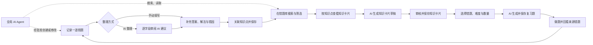

# 知拾功能使用流程（现状基线）

> 盘点日期：2026-09-04
>
> 盘点对象：`main` 分支当前工作树中的实际挂载界面与服务边界
>
> 文档目的：先统一“用户从哪里进入、做什么、系统如何反馈、结果保存到哪里”，再据此优化整体使用流程。本文描述现状，不代表所有现有交互都应继续保留。

本文以静态代码盘点为主，未把尚未进行的桌面端真实 AI、凭据、文件生命周期和完整键盘走查写成“已实机验证”。

## 1. 产品主流程

知拾当前围绕“记录错题 → 整理错因 → 沉淀知识 → 生成复习题 → 再次练习”形成闭环，AI Agent 是贯穿各页面的辅助入口。

开始正式优化前，应优先保证这条闭环中的上下文能够连续传递：用户当前选择的学科、章节、知识点、来源错题和 AI 任务状态，不应因为打开详情或切换页面而无故丢失。

## 2. 运行环境与能力边界

应用在浏览器预览和 Tauri 桌面程序中共用同一套界面，但二者不是同一种运行结果。

| 能力 | 桌面程序 | 浏览器预览 |
|---|---|---|
| 错题与复习题 | 通过 Tauri 命令保存到本地数据存储 | 保存到浏览器 `localStorage`，首次打开带示例数据 |
| 图片 | 导入并管理本地资产 | 以浏览器预览数据保存 |
| AI 服务 | 可连接 Codex、DeepSeek 或自定义 API | 不可使用真实 AI 接入与生成 |
| 知识卡片 | 草稿和已保存内容可持久化 | 仅用于界面预览，不形成可靠持久化记录 |
| AI Agent | 使用桌面运行时和真实工具 | 只执行本地模拟流程 |
| 凭据 | API Key 进入系统凭据库；Codex 使用知拾专用登录目录 | 不保存真实凭据 |

界面顶栏和 Agent 标题区会显示“桌面运行”或“浏览器预览 · 本地模拟”。流程设计和验收时必须保留这个区别，不能用浏览器模拟成功代替桌面真实成功。

## 3. 功能入口总览

| 功能 | 主要入口 | 用户最终得到的结果 |
|---|---|---|
| 错题库与知识空间 | 左侧“错题与知识”或点击展开状态下的品牌区 | 浏览、搜索、筛选错题，并进入知识卡片或复习题 |
| 新增错题 | 左侧“新增错题”、顶栏“新增错题”、空状态按钮 | 新建一张草稿或已整理错题卡片 |
| 卡片详情 | 点击错题卡或复习题卡 | 查看完整内容、编辑、删除或追溯来源 |
| AI 整理 | 新建/编辑错题页面右侧面板；详情页“AI 重新整理” | 获得逐字段建议，确认后填入表单 |
| 知识卡片 | 首页内容区“知识卡片”标签 | 查看按知识点汇总的学习内容，生成并审核 AI 草稿 |
| 复习题 | 首页内容区“复习题”标签 | 查看已保存复习题，或根据来源错题生成新题 |
| AI 接入 | 左侧“AI 接入” | 登录、配置、测试和切换当前 AI 服务 |
| AI Agent | 所有页面右下角“AI Agent”浮动按钮 | 对话、查询卡片，或经批准创建、修改、删除卡片 |

## 4. 当前统一规则

### 4.1 内容状态

- 一张卡片只要有题目文字或至少一张图片即可保存。
- 仅有图片、缺少知识点或整理信息不完整时，卡片通常为“草稿”。
- 有题目和至少一个知识点，并满足以下任一条件时，卡片为“已整理”：
  - 填写了“我的答案”，同时填写错误类型，并至少填写“第一处错误”或“错误原因”之一；
  - 没有填写“我的答案”，但填写了正确解法。
- 每张错题最多关联 3 个主要知识点。
- 编辑已有卡片时使用 revision 防止旧页面覆盖新版本；冲突时保留当前草稿，并要求重新载入。

### 4.2 AI 结果的确认与保存

这是目前最需要统一用户心智的部分。

| AI 功能 | 生成完成后的状态 | 是否自动写入 | 用户还需做什么 |
|---|---|---|---|
| 错题 AI 整理 | 形成逐字段建议 | 不自动修改已保存卡片 | 勾选字段 → 接受所选 → 点击“保存卡片” |
| AI 知识卡片 | 自动保存为“待审核草稿” | 自动写入知识卡片草稿 | 审核后“保存知识卡片”，或放弃草稿 |
| AI 复习题 | 自动生成独立习题卡片 | 生成成功后直接加入练习题库 | 打开查看；不需要二次确认 |
| AI Agent 读操作 | 返回搜索或读取结果 | 自动执行只读工具 | 无需审批 |
| AI Agent 写操作 | 显示操作目标和影响 | 未批准前不写入 | 明确选择“批准执行”或“拒绝” |

### 4.3 后台运行

- 错题 AI 整理、知识卡片生成和复习题生成都允许用户在应用内离开当前页面，返回后继续查看进度或结果。
- “可以离开本页”只表示应用内导航；不能理解为关闭或刷新应用后任务仍会继续。
- 知识卡片生成成功后会先持久化为草稿；复习题生成成功后会直接持久化为习题卡。
- 当前没有统一的后台任务中心。错题整理、知识卡片生成和复习题生成也没有统一的取消入口；Agent 运行则可以单独“停止本轮”。

## 5. 各功能使用流程

### 5.1 启动与全局导航

**目标**：确认当前运行环境，并进入主要任务。

1. 打开应用，查看顶栏运行标识。
2. 通过左侧导航进入“错题与知识”“新增错题”或“AI 接入”。
3. 在桌面宽布局中，可以收起侧栏；收起状态会写入本地设置并在下次打开时恢复。
4. 侧栏收起后，点击品牌图标会重新展开；侧栏展开时点击品牌区回到首页。
5. 顶栏“新增错题”在各页面都提供快速入口。
6. 右下角 Agent 浮动按钮在各页面保持可用。

**关键状态与分支**：

- 未知地址会回到首页。
- 页面加载期间显示加载状态。
- 首页才显示知识树；进入详情、编辑或 AI 设置后，知识树暂时隐藏。
- 当前知识树选择保存在应用组件状态中：同一次应用会话内返回首页通常仍在，但刷新或重启后不会恢复。

### 5.2 错题库搜索、知识树筛选与内容切换

**目标**：从大量错题中定位一个范围，再选择看错题、知识卡片或复习题。

1. 进入“错题与知识”。
2. 可在左侧“知识脉络”中搜索学科、章节或知识点。
3. 展开“学科 → 章节 → 知识点”，点击任意层级限定范围；再次点击同一项可取消，底部也可清除筛选。
4. 可在内容区搜索框输入题目、答案、解法、错因、错误类型或知识点关键词。
5. 卡片搜索和知识树筛选会叠加生效。
6. 在内容区切换：
   - **关联错题**：显示当前组合条件下的错题；
   - **知识卡片**：显示当前范围内按具体知识点聚合的卡片；
   - **复习题**：显示当前范围内已保存的习题卡，前提是当前数据中存在可用知识点。
7. 点击错题卡进入详情；卡片也支持聚焦后按 Enter 打开。

**结果与反馈**：

- 卡片按更新时间倒序排列。
- 卡片摘要显示学科、草稿/已整理状态、图片标记、题目、错因、知识点、错误类型和更新时间。
- 无数据、无匹配结果、读取中和读取失败分别显示不同状态。

**当前上下文边界**：

- 左侧知识树搜索只负责定位分类，不搜索题目正文。
- 内容区搜索负责搜索卡片内容，不改变知识树结构。
- 从列表打开详情后，详情页“返回”固定回首页。知识树选择在当前会话中可保留，但内容搜索词和当前标签会重置。

### 5.3 手动新增错题

**目标**：先快速留下原始材料，再逐步整理为结构化错题。

1. 从侧栏、顶栏或空状态进入“新增错题”。
2. 在“题目材料”中确认学科，并输入题目文字或添加题目图片；二者至少有一项。
3. 在“作答与诊断”中按需要填写：我的答案、正确答案、第一处错误、错误原因、错误类型、正确解法和补充说明。
4. 在“知识归档”中：
   - 从已有知识树选择学科、章节和知识点；或
   - 输入章节和新知识点创建关联。
5. 最多保留 3 个主要知识点，可逐项移除。
6. 点击“保存卡片”。系统按内容完整度自动标记“草稿”或“已整理”。
7. 保存成功后进入卡片详情页。

**快速收集分支**：

- 用户可以只上传图片后保存为草稿，稍后再补充题目和诊断。
- 完全没有题目文字和图片时不能保存。
- 新建过程中每 700ms 将变更暂存到本地草稿。
- 点击返回时，用户可以“继续编辑”“不保存”或“保存草稿”。如果 AI 正在整理，选择“保存草稿”后任务可关联到新建出的卡片，稍后继续查看。

### 5.4 图片导入与调整

**目标**：把拍照题目处理成可阅读的卡片附件。

1. 在卡片编辑器中点击上传区，或把图片拖入上传区。
2. 系统检查文件类型和大小：支持 PNG、JPG、WebP，单张不超过 15MB。
3. 合法图片进入“调整题目图片”弹窗，此时尚未写入卡片。
4. 可向左/向右旋转、拖拽框选保留区域或重置。
5. 点击“确认使用”，系统导出并导入处理后的图片；超大图片会等比缩小到 1600 万像素以内。
6. 图片出现在编辑器预览区，仍可删除。
7. 保存卡片后，图片才成为该卡片的正式资产。

**异常与取消**：

- 文件类型错误、超过大小上限、读取失败或处理失败都会保留在当前编辑上下文并显示错误。
- 在图片弹窗中点击取消、关闭、遮罩或按 Escape，不导入图片。
- 未保存的新图片被移除或放弃新卡片时会尝试清理；编辑已有卡片时，被移除的旧图片在正式保存成功后清理。

### 5.5 使用 AI 整理错题

**目标**：让 AI 提供结构化建议，但不直接覆盖用户内容。

1. 在新建或编辑页面准备题目文字或图片。
2. 可在“补充 AI 要求”中指定侧重点或表达方式。
3. 点击“AI 整理”。
4. 如果当前 AI 未连接，系统尝试连接当前服务；仍不可用时显示错误，原始内容保留。
5. 任务开始后显示准备、分析和校验等进度；可在应用内离开页面。
6. 生成完成后，逐项查看题目、答案、解法、第一处错误、错误原因、错误类型和知识点建议。
7. 重点检查：
   - AI warnings；
   - 标记为“不确定”的字段及原因；
   - 生成期间被用户再次修改、因此显示冲突的字段。
8. 勾选需要采纳的字段，点击“接受所选”；也可“拒绝全部”。
9. 接受建议只修改当前表单，不会立即修改已保存卡片。
10. 最后点击“保存卡片”完成持久化。

**异常与恢复**：

- 无题目和图片时阻止启动。
- 上次生成失败后可以忽略或重新整理。
- AI 建议生成后若关闭或刷新整个应用，未合入表单的建议没有持久化保证。
- 当前界面没有单独取消错题整理任务的入口。

### 5.6 查看卡片详情

**目标**：查看一张错题或复习题的完整学习记录。

1. 从错题库、知识卡片来源列表或复习题列表打开卡片。
2. 查看题目、最近修改时间、学科和状态。
3. 错题详情依次展示原图、作答对照、正确解法、错因诊断、补充说明和知识点路径。
4. 复习题详情展示参考答案、正确解法、知识点，以及“来源错题与版本”。
5. 复习题的来源记录可点击回到仍然存在的原始错题；来源已删除时按钮不可用。
6. 错题可进入“编辑卡片”或“AI 重新整理”；复习题可进入普通编辑。

### 5.7 编辑、草稿恢复、版本冲突与删除

**目标**：安全修改已有内容，避免误覆盖和误丢失。

1. 从详情页进入编辑器。
2. 修改任意字段后，系统每 700ms 自动保存本地编辑草稿，并显示“正在暂存/草稿已保留”。
3. 点击返回时：
   - 无修改则直接返回详情；
   - 有修改则提示离开，确认后仍保留草稿。
4. 再次进入同一 revision 的卡片时自动恢复草稿。
5. 点击“保存卡片”，系统携带进入编辑器时的 revision。
6. 如果卡片已经在别处更新，系统拒绝覆盖，显示版本冲突并保留当前草稿；用户可重新载入最新版本。
7. 保存成功后清除编辑草稿并回到详情。

**删除流程**：

1. 从详情页或已有错题编辑页点击“删除”。
2. 确认“删除后无法恢复”。
3. 删除成功后返回首页；失败则保留当前页面并显示错误。

### 5.8 查看与生成知识卡片

**目标**：把同一知识点下的多道错题汇总成可复习内容。

1. 在首页切换到“知识卡片”。
2. 未选择具体知识点时，查看当前范围内的知识卡片网格。每个具体知识点对应一张卡，显示来源错题数、错误样本数、内容预览和状态。
3. 点击“查看知识卡片”，系统选中对应具体知识点并进入详情。
4. 详情默认根据来源错题展示核心方法、易错提醒和来源列表。
5. 可展开来源错题并进入原卡详情。
6. 如需 AI 内容：
   - 填写可选的补充要求；
   - 点击“AI 生成”或“重新生成”；
   - 任务在应用内后台运行；
   - 完成后自动持久化为“待审核草稿”。
7. 审核 AI 草稿和 warnings。
8. 来源错题 revision 未变化时，可“保存知识卡片”；也可确认后“放弃草稿”。
9. 如果来源错题已变化，当前草稿会标记过期并阻止保存，需要重新生成。

**重要现状**：

- 同一知识点当前只保存一条知识卡片记录。
- 对一张“已保存”知识卡片执行重新生成时，新内容会以草稿状态覆盖该知识点当前记录。
- 此时“放弃草稿”会删除当前记录，而不是自动恢复上一版已保存内容。这是后续流程设计必须明确处理的高风险分支。

### 5.9 查看与生成复习题

**目标**：基于真实错题和错误点生成新的相似练习。

1. 在首页切换到“复习题”，先查看当前知识范围内已经保存的习题卡。
2. 点击“AI 生成复习题”或空状态中的“开始生成”。
3. 在生成设置中依次完成：
   1. 选择一个或多个知识点；
   2. 从范围内选择具体来源错题，可全选或取消全选；
   3. 选择“更简单 / 持平 / 更难”；
   4. 设置生成数量；
   5. 可选填题型、侧重点或表达方式等补充要求。
4. 生成数量下限等于已选来源错题数，确保每道来源题至少对应一张；当前上限为 50 张。
5. 右侧摘要确认知识点数、来源错题数、难度和习题数量。
6. 点击“AI 生成并保存”。
7. 任务在应用内后台运行；完成后所有成功结果直接作为独立复习题卡片写入练习题库。
8. 新卡片标记“刚刚生成”，可进入详情查看答案、知识点和来源 revision。
9. 需要更多题目时再次进入生成设置。

**异常与约束**：

- 未选择来源错题时不能生成。
- 生成期间若来源错题被修改或删除，保存阶段会因 revision 冲突失败，避免基于过期来源落库。
- 当前没有“生成预览 → 选择保留 → 再保存”的中间步骤，也没有批量撤销本次生成的入口。

### 5.10 配置与切换 AI 服务

**目标**：为 AI 整理、知识卡片、复习题和桌面 Agent 指定可用模型服务。

#### Codex 登录

1. 进入“AI 接入”，选择 Codex。
2. 点击“通过浏览器登录”。
3. 在官方页面完成账号授权，然后返回知拾。
4. 登录成功后 Codex 自动设为当前服务。
5. 已登录但不是当前服务时，可点击“设为当前”。
6. 可重新登录，或经确认退出知拾专用 Codex 登录。

Codex 使用独立凭据边界，不读取本机其他 Codex 配置和登录缓存；退出时只清理知拾专用登录。

#### DeepSeek 或自定义 API

1. 选择 DeepSeek，或点击“新增自定义 API”。
2. 填写服务名称（自定义服务）、API Key、Base URL 和模型名称。
3. 可临时显示或隐藏本次输入的 Key。
4. 点击“测试连接”验证参数。
5. 点击“保存配置”；保存成功后该服务自动成为当前服务。
6. 已配置服务再次编辑时，API Key 留空表示保留原 Key，页面不会回显旧 Key。
7. 非当前服务可“设为当前”；不再使用时可确认删除配置和 Key。

**异常与边界**：

- 读取、登录、测试、保存或删除失败时，在当前面板显示反馈。
- AI 设置页的“返回”使用历史返回；直接从外部地址进入时，其返回目的地取决于当前导航历史。
- 浏览器预览会显示服务面板，但真实登录、测试和保存不可用。

### 5.11 使用 AI Agent

**目标**：用自然语言查询学习资料，或通过审批安全地修改卡片。

1. 在任意页面点击右下角“AI Agent”。
2. 确认运行环境、运行模式和思考强度：
   - **自动**：允许调用只读工具，并可提出写操作审批；
   - **仅聊天**：不读取或修改卡片；
   - **思考强度**：低、中、高，在下一轮请求中生效。
3. 可展开“可用工具”查看每个工具是“只读”还是“需批准”。
4. 输入文字，或使用快捷建议。
5. 可输入 `@` 搜索并引用已有卡片；最多显示 5 个候选。
6. 可选择或拖入图片：单轮最多 3 张，单张不超过 15MB，可在发送前移除。
7. 按 Enter 发送，Shift+Enter 换行。
8. 时间线依次显示用户消息、决策摘要、工具开始/完成、审批卡和最终消息。

**只读任务**：

1. Agent 自动执行搜索、读取卡片或搜索知识点。
2. 用户查看结果，无需审批。

**创建、修改或删除任务**：

1. Agent 先读取必要上下文。
2. 写操作前显示工具名称、目标和影响。
3. 用户选择：
   - **拒绝**：不修改数据；
   - **批准执行**：执行写操作，完成后刷新卡片数据。

**运行控制**：

- 运行中可以“停止本轮”。
- 收起 Agent 不会清空当前对话；按 Escape 也可收起。
- 新对话只能由标题栏“新对话”按钮创建。聊天文字要求创建新对话时不会重置历史。
- 点击“新对话”时，活动任务先取消，待审批写操作会被拒绝，然后清空当前内存时间线。
- 当前对话、任务记录和审批状态主要保存在页面内存中，刷新或重启后不保证恢复。
- 收起 Agent 后，当前浮动按钮没有单独展示“运行中”或“待审批”数量。

## 6. 四条常用端到端流程

### 6.1 只想先把题目记下来

`新增错题 → 上传图片或输入题目 → 返回 → 保存草稿 → 稍后从错题库打开 → 补充整理 → 保存`

适合移动式收集或暂时没有时间整理的场景。优化重点是缩短首次保存路径，并确保后续能容易找到未完成草稿。

### 6.2 完整整理一道错题

`新增错题 → 记录作答 → AI 整理 → 审核并选择建议 → 关联知识点 → 保存 → 详情核对`

优化重点是让“AI 建议已接受”和“卡片已正式保存”有足够清晰的状态差异。

### 6.3 围绕一个知识点学习并练习

`知识树选择具体知识点 → 查看关联错题 → 查看/生成知识卡片 → 审核保存 → 进入复习题 → 选择来源与难度 → 生成并保存 → 打开习题与来源`

优化重点是保留知识点上下文、降低标签切换成本，并让来源证据始终可追溯。

### 6.4 让 Agent 帮助维护卡片

`打开 Agent → @ 引用卡片或描述范围 → Agent 读取 → 查看结论 → 发起修改 → 审核影响 → 批准/拒绝 → 回到卡片核对`

优化重点是让审批内容足够具体，并在 Agent 收起或切换页面后继续提示运行和待审批状态。

## 7. 后续流程优化议题

以下问题来自当前流程本身，建议先做决策，再画新版页面或改代码。

| 优先级 | 议题 | 当前行为 | 需要决定的问题 |
|---|---|---|---|
| P0 | 统一 AI 结果心智 | 错题建议不自动保存、知识卡自动存草稿、复习题自动正式保存、Agent 写入需审批 | 是否统一为“AI 生成草稿 → 用户确认 → 正式保存”，哪些场景允许明确例外？ |
| P0 | 知识卡片重新生成与撤销 | 新草稿覆盖同一知识点记录，放弃草稿会删除记录 | 是否保留“上一已保存版本”，让放弃新草稿真正回滚？ |
| P0 | 复习题生成后的审核 | 生成成功即批量写入，最多一次 50 张 | 是否需要生成前确认、生成后批量筛选、撤销本批次或失败明细？ |
| P1 | 后台任务可见性 | 三类生成任务分散在各自页面，无全局队列，只有 Agent 可取消 | 是否增加统一任务入口、跨页状态、失败重试与取消能力？ |
| P1 | 返回后的上下文连续性 | 打开详情再返回会丢失内容搜索词和当前标签；知识树选择仅会话内保留 | 哪些筛选、标签和滚动位置应恢复？“返回”应回到来源位置还是固定首页？ |
| P1 | 两个搜索框的职责 | 左侧搜索分类，内容区搜索卡片，二者叠加但缺少整体条件说明 | 是否统一搜索入口，或明确显示当前组合筛选条件？ |
| P1 | 草稿/已整理状态可理解性 | 状态由字段组合自动计算，用户看不到达成条件 | 是否在编辑器直接提示“还缺什么才能成为已整理”？ |
| P1 | AI 不可用后的恢复路径 | 编辑器尝试连接当前服务，失败后只显示错误 | 是否在错误中提供“前往 AI 接入”并在配置后返回原任务？ |
| P1 | Agent 的跨页提醒 | 收起后看不到运行中或待审批数量；会话只在内存 | 是否增加全局状态徽标，以及是否需要恢复最近会话和待处理任务？ |
| P2 | 设置页返回行为 | 使用浏览历史返回 | 是否改为稳定返回来源页，并为直接进入设置提供明确默认目的地？ |

## 8. 新流程设计的验收清单

后续每次调整某条流程，至少核对以下项目：

1. **入口**：用户能否从最可能的上一任务自然进入，而不是必须记住菜单位置？
2. **前置条件**：需要知识点、来源错题或 AI 服务时，界面是否提前说明？
3. **进行中反馈**：是否显示当前阶段、是否能离开、是否能取消？
4. **确认边界**：AI 结果、删除、批量生成和 Agent 写入何时真正落库？
5. **成功结果**：完成后用户是否能立即看到结果，并知道下一步可以做什么？
6. **失败恢复**：失败是否保留用户输入，是否有重试或配置入口？
7. **返回行为**：返回后筛选、标签、搜索、滚动和草稿是否按预期保留？
8. **来源与版本**：知识卡片和复习题是否能追溯到准确的来源 revision？
9. **可访问性**：键盘能否完成流程，焦点顺序和状态播报是否清楚？
10. **运行环境**：浏览器模拟和桌面真实结果是否被清楚区分并分别验收？

## 9. 代码与既有文档索引

| 范围 | 主要位置 |
|---|---|
| 路由与全局导航 | `src/App.tsx`、`src/components/AppShell.tsx` |
| 错题库与知识树 | `src/features/cards/CardsPage.tsx`、`KnowledgeTreeFilter.tsx`、`KnowledgeContextView.tsx` |
| 新建、编辑与 AI 整理 | `src/features/cards/CardEditorPage.tsx`、`CardEditorFields.tsx`、`AiReviewPanel.tsx` |
| 图片处理 | `src/features/images/ImageEditorDialog.tsx`、`useImageImport.ts` |
| 知识卡片 | `src/features/cards/KnowledgeCardView.tsx`、`learningGenerationRun.ts` |
| 复习题 | `src/features/cards/ReviewView.tsx`、`ReviewBuilder.tsx`、`ReviewCardList.tsx` |
| AI 接入 | `src/features/ai-connections/AiConnectionsPage.tsx` |
| AI Agent | `src/features/agent/AgentWorkspace.tsx`、`useAgentHarness.ts` |
| 旧版功能与旅程证据 | `docs/archive/ui-redesign/feature-inventory.md`、`journey-matrix.md`、`behavior-contracts.md` |

后续如果某项功能入口、保存规则或异常分支发生变化，应同步更新本文相应章节，而不是只更新页面截图。
