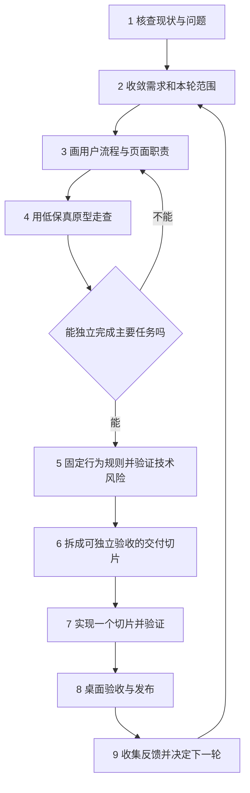
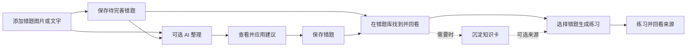

> 当前范围变更（2026-09-05）：知识卡模块已按用户要求移除，知识点分类保留；旧的知识卡保留/生成/编辑条目已废止。执行结果见 [盘点清单](./知识卡移除与复习卡展开实施清单.md)。

# 知拾项目升级：从需求到落地步骤计划书

> 版本：0.6｜日期：2026-09-05｜状态：供应商与侧栏原型已补齐，正式实现已开始
>
> 执行进展：用户已授权开始实施本计划，待决策问题直接在对话中提出，由用户通过对话回答，不使用 Codex 原生提问功能。当前进入 S0 现状核查和需求收敛；具体产品取舍以本页确认记录为准，不把“开始实施”解释为全部建议获批。

执行证据和问题清单见[项目升级执行记录](./项目升级执行记录.md)。

升级应按“明确问题 → 收敛需求 → 设计用户流程 → 验证原型 → 明确行为与技术边界 → 拆分交付 → 实现与验收 → 发布与反馈”推进。每一步只补足下一步需要的信息，发现问题时回到对应步骤修正。

对知拾，建议先让用户顺畅完成“留下一道错题、整理并保存、找到它、围绕它练习”，再扩展知识沉淀和 Agent 能力。第一轮优先减少必须理解的概念和页面往返；后端所需的可靠性机制可以保留，但不必全部出现在默认界面。

## 本轮定位更新（2026-09-05）

用户已明确：项目价值是快速从图片整理成可归档的错题卡，按学科 / 章节 / 知识点快速找题，再通过针对错误点的概念问答强化记忆、防止重犯。具体方案和重大待决策项见[错题整理与错因复习：重设计方案](./错题整理与错因复习-重设计方案.md)。

本轮新主流程的练习生成改为错因问答，不再以泛化仿真题或笔记沉淀为目标。下文旧表中的“练习”在新主流程中按此解释。知识卡与旧练习数据保留；正式旧入口的去留分别按 K01、K02 等待用户选择。C03 全卡编辑与联网、C04 应用后另存、C05 一次授权生成并保存不变。原型新增图片前置、知识树与 @ 逐级补全，C06 仍未验收。

## 0. 需要你确认的内容

本文中的“你”指项目负责人，也就是提出本次升级需求的用户。**请优先看下面的确认清单；不需要逐段批准整份文档。** 正文使用相同编号标注对应位置。

- **【需你确认 Cxx】**：涉及产品方向、范围或保存行为的取舍，由你决定。表中的推荐方案不等于已获确认。
- **【后续验收 Cxx】**：先准备原型、测量结果或可交付版本，再请你确认具体成果；当前不要求提前批准尚不存在的结果。
- **【可直接执行】**：在已授权范围内，由开发者完成调查、方案准备、文档维护、实现及必要验证，无需再次逐项询问。用户已授权按计划开始实施；依赖产品决策的工作在对应决定后推进。

### 0.1 产品决策：收敛需求时集中确认

| 编号 | 需要你决定的内容 | 推荐方案 | 其他选择及影响 | 最晚确认时点 | 当前状态 |
|---|---|---|---|---|---|
| C01 | 本轮主要服务谁、优先解决什么问题？ | 优先服务个人错题学习；解决收集、整理保存、查找与练习路径不清楚的问题 | 若更重视知识管理或自由 AI 学习，应重新排序主流程与验收任务 | 本轮需求范围定案前 | 已确认：错题学习闭环，2026-09-05 |
| C02 | 本轮做到哪里，哪些能力后置？ | 交付 S1～S3；知识沉淀完善 S4 后置；已有能力保留，复杂任务管理等新增扩展延期 | 纳入 S4 会扩大本轮范围；只做 Agent 简化则不能同时解决完整学习流程问题 | 切片范围与排期确定前 | 已确认：选择 A，S1～S3 本轮交付、S4 后置，2026-09-05 |
| C03 | Agent 与业务页如何分工？ | 用户已定案：业务页直接完成明确任务；Agent 具备所有类型卡片的完整编辑能力和联网搜索能力 | 本轮落实双入口共享业务规则；界面简化不能削减 Agent 编辑和搜索能力 | 确定主原型方向前 | 已确认：用户补充方案，2026-09-05 |
| C04 | 错题 AI 建议如何应用和保存？ | 保留“应用建议 → 保存错题”，把尚未保存的状态说明清楚 | 改成“应用并保存”可减少一次动作，但需先展示冲突、局部采纳与保存失败的完整方案 | 错题审核和保存规则生效前 | 已确认：先应用再保存，2026-09-05 |
| C05 | 练习生成后的入库授权放在哪里？ | 在来源与参数页用“生成并保存”一次明确授权，合格结果直接入库；不再增加含义相同的批准页 | 已不采用独立计划批准页或生成后审核入库 | 练习生成规则生效前 | 已确认：生成并保存，2026-09-05 |

C01～C05 直接在对话中逐题询问，每题说明建议及影响；后续新增问题和 C06～C08 验收问题同样通过对话回答。用户偏好明确的选择，避免宽泛问题。因原生提问功能会在答复前消失，不再调用该功能。只有用户实际回复才能更新决定；未回复继续标为待确认，已经明确决定的项目不重复询问。

### 0.2 阶段成果：准备好具体内容后再请你确认

| 编号 | 到时需要你确认什么 | 提交给你的具体材料 | 确认后的作用 | 当前状态 |
|---|---|---|---|---|
| C06 | 简化原型是否符合你的使用习惯，并可作为本轮实现依据？ | 可操作原型、走查问题与修订结果、最终页面职责和 PRD 差异；包含 C03～C05 的具体落地表现 | 固定本轮产品行为，进入对应切片开发；不是批准所有后续扩展 | 用户明确要求补齐供应商与侧栏后开始实现；已进入工程阶段，视觉与真实任务验收仍待补 |
| C07 | 用什么标准判断本轮升级成功？ | 升级前基线、任务清单、建议目标及测量方法 | 在正式实现和验收前固定标准；不能在结果不理想时临时改口径 | 待基线测量后提交 |
| C08 | 本轮可运行版本是否满足实际使用需要，何时交付使用？ | 桌面走查结果、自动验证记录、已知缺口、正式产物及必要的迁移/回退说明 | 完成产品验收并决定交付；提交、推送和发布沿用届时明确的授权范围 | 待可交付版本与证据准备 |

C06、C07 可以在同一次评审中确认。C08 前先完成已授权的构建和验证；有必要变更授权范围时再说明具体动作。已有明确授权不重复索取，未验证项不能因你同意而标成“已验证”。

### 0.3 无需你逐项确认的工作

**【可直接执行】** 在相应工作已授权后，现状代码核查、步骤统计、原型候选方案准备、文件组织、任务拆分、常规实现选择、必要测试、链接与格式检查，由开发者连续完成。现有 `AGENTS.md` 的测试和正式产物要求直接遵守；来源追溯、冲突保护与避免数据丢失等已有约束不列为可随意取消的选项。

尚未确认的决策只限制依赖它的最终定案或实现，不阻止独立调查和准备可供评审的方案。确认后在本清单记录“结论、日期、影响范围”，同步修改正文与相关 PRD；本次补充确认标记不改变任何项目的批准状态。

## 1. 当前问题与本次升级目标

### 1.1 本次核查到的事实

本次依据仓库文档、demo 源码和实际挂载入口作静态核查，未进行桌面实机走查，也未取得用户行为统计。

| 观察 | 仓库依据 | 对升级的影响 |
|---|---|---|
| demo 的 Agent 同时提供任务首页、三类任务配置、任务记录、进度、输入框和结果跳转 | [Agent 视图](demo/ai-agent-workflows/index.html)、[窗口结构](demo/ai-agent-workflows/index.html) | 同一窗口承担多种职责，需要重新分配默认可见内容 |
| 生成知识卡/练习时，来源选择会离开 Agent，完成后再返回；审核又进入主内容区 | [demo 交互](demo/ai-agent-workflows/index.html) | 主任务存在多次跨区域往返，需逐步统计并缩短 |
| 用户界面直接展示“冻结快照”“owned_upload”“单执行器”“事务保存”等术语，并含模拟失败、完成等演示按钮 | [Agent 视图](demo/ai-agent-workflows/index.html) | 开发解释、演示控制和用户操作需要分开处理 |
| 现状文档记录了错题建议、知识草稿、练习直接入库、Agent 批准写入等不同保存语义 | [现状使用流程](./功能使用流程.md) | 应让每个动作的效果清楚可见，不能简单把所有按钮改成“确认” |
| 既有 PRD 标为“方案评审稿”，又将未标记规则称为冻结需求；另有明确废止的历史冻结清单 | [PRD](./AI生成练习卡-PRD.md)、[历史合约](./demo/ai-agent-workflows/contract-freeze.md) | 下一轮必须给出确切的生效版本和变更记录，避免不同文档各自驱动开发 |
| 正式 Agent 挂载入口为 `AgentWorkspace`，与该静态 demo 分离 | [应用路由](../src/App.tsx)、[应用外壳](../src/components/AppShell.tsx)、[正式 Agent](../src/features/agent/AgentWorkspace.tsx) | demo 的交互效果不能当成正式工程已完成的能力 |

**初步判断**：复杂度可能主要来自页面职责叠加、用户动作与内部机制混杂，以及需求范围缺乏稳定的交付顺序。此判断需通过真实任务走查验证，不能把“看起来元素多”直接等同于全部功能应删除。

### 1.2 升级要取得的结果

1. 用户知道从哪里开始、当前做到哪一步、下一步做什么、内容是否已经保存。
2. 不配置 AI 也能收集、编辑、保存和查找错题。
3. AI 可以减少整理工作；用户无需先学会任务管理才能完成普通操作。
4. 开发者能从一个需求找到对应流程、实现任务、测试和验收证据。
5. 每次交付都有可用的完整路径、明确缺口和回退方式。

## 2. 升级工作的总顺序

这是一套小项目也能执行的流程。一个人可以兼任产品、设计、开发和测试职责；仍需区分“提出方案”“决定范围”“实现功能”“验证结果”。不要求每一步召开会议或生成独立长文档。

已有授权范围内的调查、文档完善、实现和验证应连续推进。只有会改变产品方向、扩大范围或改变数据写入行为的未决事项，才集中提交具体选项供产品负责人决定；不逐按钮、逐文件索要确认。

## 3. 每个阶段怎么做、交付什么、何时进入下一步

| 阶段 | 主要动作 | 最小产出 | 进入下一步的条件 | 主责 |
|---|---|---|---|---|
| 1. 现状与问题 | 走完真实任务；区分现有能力、demo 表达和目标设想；记录卡点 | 一份带依据的问题清单、现状步骤与基线数据 | 每个优先问题都有具体触发场景和影响 | 产品牵头，开发核实 |
| 2. 需求与范围 | 明确主要用户、使用场景、预期结果；把能力分为本轮、后续、保留但不改 | 简版需求表、范围边界、待决策项 | 本轮价值能用一句话说明；每项需求都有验收结果 | 产品决定，设计/开发评估 |
| 3. 流程与职责 | 先画主路径和失败路径；定义各页面入口、动作、结果落点 | 用户流程图、页面职责表、保存语义表 | 一条流程没有重复录入、含义不明的确认和无出口状态 | 设计牵头，产品核对 |
| 4. 原型验证 | 用静态低保真 demo 验证动作顺序；先走查再做视觉细化 | 单一主原型、逐任务走查记录、问题修订 | 核心任务可无口头提示完成；无未解决的数据误解 | 设计执行，用户参与 |
| 5. 行为与技术 | 固定保存、冲突、失败、重试、取消规则；验证最不确定的技术环节 | 当轮 PRD/功能台账、精简技术方案、风险验证证据 | 数据副作用明确；高风险环节有实证或可接受替代方案 | 开发牵头，产品决定语义 |
| 6. 交付拆分 | 按完整用户结果拆任务；列依赖、范围、验证方式与回退方案 | 排好顺序的切片任务表 | 首个切片能独立演示和验收；没有只做一半的关键依赖 | 开发负责 |
| 7. 实现与验证 | 一次完成一个切片的界面、服务、状态与必要测试 | 可运行增量、差异、测试记录、已知限制 | 对应验收条件满足；所需检查通过 | 开发实现，测试核对 |
| 8. 验收与发布 | 在正式桌面环境走真实路径；验证旧数据和正式产物 | 验收记录、发布说明、正式 EXE、回退步骤 | 无阻断问题；发布内容、未验证项和回退边界可见 | 产品验收，开发交付 |
| 9. 反馈与下一轮 | 对照原问题复测；观察真实使用中的新卡点 | 本轮效果记录、下一轮排序后的需求 | 以证据决定继续、修正或停止某项扩展 | 产品决定 |

技术风险特别高时，可在第 2～4 阶段提前做小范围验证，例如图片能否经现有接口送达模型。只回答具体问题，不提前搭建完整任务平台。

**确认节点对应关系**：第 2 阶段确认 C01、C02；第 3～5 阶段明确 C03～C05；原型和基线准备完成后确认 C06、C07；第 8 阶段确认 C08。其余阶段按已确认范围连续推进。

## 4. 知拾第一轮应怎样收敛需求

### 4.1 先回答四个问题

**【已确认 C01】** 用户于 2026-09-05 选择“错题学习闭环：让收集、整理保存、查找和练习更清楚”。下表中的具体使用频率与情境仍需调查，不将产品目标选择当成行为实测。

| 问题 | 建议工作假设 | 验证方式 |
|---|---|---|
| 谁最常使用？ | 需要持续收集和复习错题的个人学习者 | 用用户最近实际处理的几道错题复盘，确认是否符合 |
| 最常从哪里开始？ | 先有一道错题的图片或文字 | 记录当前新增、查找、练习入口的使用情境 |
| 最小有效结果是什么？ | 错题保存成功，之后能找到并理解它 | 让用户隔一段操作后重新定位该错题 |
| 第一轮升级解决什么？ | 从收集错题到整理保存、查找和生成练习的路径清楚可用 | 完成第 7 节同一组走查任务，对比升级前后 |

以上是起草用假设；没有走查记录前，不预设所有用户都需要先整理知识卡，也不预设所有 AI 操作都必须经过 Agent。

### 4.2 已确认的本轮范围

**【已确认 C02】** 用户于 2026-09-05 选择 A：本轮完成错题收集、整理、回看和练习，并简化 Agent；知识卡深度改造后置。对应 S1～S3 本轮交付、S4 后置，已有知识卡能力保留。新增评分、作答记录或其他扩展不自动纳入本轮。

| 优先级 | 内容 | 取舍依据 |
|---|---|---|
| P0 | 采集与手工保存、AI 整理审核、查找回看、返回上下文、失败后恢复 | 直接影响每天能否顺利使用 |
| P0 | Agent 默认界面减负，支持所有类型卡片的完整编辑和联网搜索；业务页直接完成普通任务 | C03 已明确能力与分工，简化界面同时补齐必要工具能力 |
| P1 | 从明确错题来源生成练习并回看原题 | 补齐本轮最小复习闭环 |
| 后续 S4 | 知识卡生成与版本保护的进一步完善 | C02 已确认后置；保留已有知识卡能力，发现数据损坏风险时仍优先处理 |
| 后续候选 | 完整任务中心、复杂队列管理、批量多题高级设置、更多自动化 | 先验证真实需求及必要性，再决定投入 |

后续候选指新增或扩大的产品能力。已有能力默认保留；不能因为简化界面就删除后台可靠性、来源追溯、冲突保护或尚未评估的用户数据。阻断核心流程或可能损坏数据的现有问题，发现后应提升优先级。

## 5. 建议的用户流程与 Agent 职责

### 5.1 产品主路径

这张图表示目标职责和路径，不表示改变了现有“草稿/已整理”判定规则。知识卡是一条可选路径，不要求每次生成练习都先生成知识卡。是否增加作答记录与评分功能，另行评估，不默认纳入本轮。

### 5.2 页面职责建议

| 区域 | 用户在这里完成什么 | 默认主要动作 |
|---|---|---|
| 错题库 | 找到错题，继续整理或选择复习来源 | 新增、搜索、打开 |
| 错题编辑/详情 | 添加材料、查看建议、修改和保存 | 根据当前状态突出“AI 整理”或“保存错题” |
| 知识卡区域 | 查看知识总结、审核新草稿、保留正式版本 | 查看或保存知识卡 |
| 练习区域 | 确认来源与参数、生成、打开练习、回看来源 | 生成练习或开始练习 |
| Agent | 自由提问、联网搜索、查找并完整编辑错题卡/知识卡/练习卡，定位结果 | 输入意图；需写入时展示具体改动与批准动作 |
| 设置 | 配置 AI 接入及应用选项 | 配置、测试连接 |

这里先定义职责，不立即决定导航项数量或新建多少页面。能在现有区域完成的任务，不为布局统一而强制新增页面。

### 5.3 Agent 简化方向

**【已确认 C03】** 用户于 2026-09-05 明确：“Agent 需要具有对所有卡片的完整编辑能力和联网搜索能力。业务也直接完成明确任务，普通操作无需打开 Agent。”最终界面通过 C06 原型验收确定。

业务页与 Agent 均可完成明确业务动作，共用卡片数据、字段校验、来源约束、版本冲突和保存协议。Agent 必须能在对话中读取目标卡片、提出具体字段改动、经批准写入并返回卡片链接；不能只提供解释或把完整编辑一律转交手工页面。普通操作仍可完全通过业务页完成。

本轮能力边界如下：

- **所有类型卡片完整编辑**：覆盖错题卡、知识卡、练习卡各自允许编辑的业务字段及关联内容。按卡片类型逐项核查字段、附件与知识点关联能力；系统 ID、版本和来源审计信息仍由系统维护，不允许任意伪造。
- **联网搜索**：Agent 可按用户意图搜索公开网络资料，回答显示可打开的来源；可据搜索结果提出卡片编辑建议。未搜索成功时明确说明，不把模型记忆写成已联网检索结果；外部网页内容不能自行授权写卡。
- **同一保存事实**：Agent 成功写入后业务页能读取最新内容；用户在业务页修改后，Agent 不得用旧版本静默覆盖。Agent 写操作继续遵守现有批准规则。
- **与 S4 的区别**：本轮包含 Agent 编辑已有知识卡所需的能力补齐；知识卡整体组织、生成流程和深度版本改造仍后置。保证正确保存与避免数据损坏的必要工作随本轮功能完成。

这些决定纳入 S2。先核查当前工具与字段缺口，再用原型呈现编辑和联网搜索路径，之后同步修订 PRD 与功能台账；不将需求确认标记为能力已实现。

| 内容 | 建议默认呈现 | 仍需保留的能力 |
|---|---|---|
| 新任务选择 | 对话空状态显示少量示例；用户可直接描述目的 | 意图不清时提供具体选项 |
| 来源与参数 | 从业务页发起时带入明确选择；可见、可调整 | 不能擅自扩大读取范围；不要求重复选择 |
| 当前进度 | 一句人能理解的状态和必要的停止动作 | 排队、停止中、失败、待处理等真实区别 |
| 历史记录 | 二级入口，出现待处理结果时给轻量提示 | 返回原任务、保留失败与待审核结果 |
| 执行细节 | 有需要时展开“详情” | 诊断所需日志、版本、来源与错误信息 |
| 全类型卡片编辑 | 对话中展示目标、改动摘要和批准动作；较长差异可展开 | 所有允许编辑字段、附件与关联规则、冲突保护和写入结果同步 |
| 联网搜索 | 对话显示搜索状态、结论和来源链接 | 真实检索、失败说明、引用追溯；搜索建议写卡仍需批准 |
| 审核和保存 | 对话给摘要与结果入口，复杂编辑放在主内容区 | 保存前明确影响、冲突提示和正式保存结果 |
| 演示控制 | 从普通使用路径移至独立演示区 | 原型仍可演示失败、取消和恢复 |

默认打开 Agent 应能立即输入或继续当前对话，不要求先完成“选任务 → 配来源 → 创建任务 → 看计划”的固定向导。明确操作需要的参数，应在适当时机补齐；来源、写入目标和删除影响不得为了少点击而隐藏。

### 5.4 保存语义先写清楚，再决定如何减少确认

**【已确认 C04、C05】** 错题先应用建议、再保存，允许继续修改并明确提示尚未保存。练习在来源与参数页点击“生成并保存”即授权合格结果入库，不增加独立计划批准页或生成后审核页。表内其他现有数据保护约束继续保留。

| 操作 | 用户必须能理解的结果 | 设计约束 |
|---|---|---|
| 保存原始材料 | 错题已保存，但内容可能待完善 | 暂存输入与正式保存必须可区分 |
| AI 整理 | 得到建议，尚未覆盖正式卡片 | AI 运行期间用户新修改的内容不能被静默覆盖 |
| 应用建议 | 已填入当前编辑内容，仍未正式保存 | C04 已确认不合并；用户可继续修改，再点击“保存错题” |
| 生成知识卡 | 新内容待审核 | 保留上一正式版本；放弃新草稿不能误删旧版本 |
| 生成练习 | 点击“生成并保存”授权合格结果直接入库 | 来源、参数和写入说明在同一提交位置；失败明确说明未保存，不重复要求批准 |
| Agent 写操作 | 哪些卡片会如何变化 | 读操作直接返回结果；写操作沿用明确批准边界 |

一致性来自“按钮文字、反馈和真实副作用一致”，不要求所有内容类型具有完全相同的保存机制。

## 6. 文档与开发流程怎样保持清晰

### 6.1 用现有文档建立单一依据

| 文档 | 负责回答 | 维护规则 |
|---|---|---|
| 本计划书 | 升级按什么顺序做、如何判定阶段完成 | 记录里程碑与流程，不扩成逐字段规格 |
| [功能使用流程](./功能使用流程.md) | 当前程序实际上怎样用 | 在交付后按核查结果更新，保留验证环境 |
| [AI 学习闭环 PRD](./AI生成练习卡-PRD.md) | 本轮目标行为及原因是什么 | 下一轮收敛后更新同一文档，写明生效版本、待决策和延期项 |
| [全流程功能清单](./AI学习闭环-全流程功能清单.md) | 哪些能力保留、改变、延期，如何验收 | 沿用已有功能 ID，补充切片和证据位置，避免另建冲突编号体系 |
| 当轮交付记录 | 谁在做什么、测试结果、是否可交付 | 需求收敛后再建立一份任务与验收记录，不为每个阶段复制一套文件 |

当前 PRD 和功能清单仍是仓库已有的目标行为记录。本文提出的修改只作为下一版修订输入；发生冲突时，相关实现项先标为待决策，不能选择对开发最方便的一份继续实现。明确废止的历史合约不再作为依据。

建议下一轮统一使用“草案 → 已评审生效 → 被替代”的版本状态。任何冻结必须写明冻结的是哪个版本、哪些范围；变更时记录原因、影响流程、涉及任务和需要补充的验证。

**【后续验收 C06】** 先将原型、走查结果和 PRD 变更准备为可对照的成果，再由你确认本轮实现依据。文档整理与版本维护由开发者执行，不要求你逐文件批准。

### 6.2 一条需求的最小模板

| 字段 | 示例：整理新添加的错题 |
|---|---|
| 需求与已有功能 ID | 从功能台账选取对应照片采集、派发和审核 ID |
| 问题 | 用户添加照片后，需要理解任务首页才能继续整理 |
| 场景与结果 | 用户已有一道错题照片，希望得到可审核并保存的错题内容 |
| 主路径 | 添加照片 → AI 整理 → 查看建议 → 应用 → 保存 |
| 异常路径 | AI 不可用、题意不清、运行中编辑、切页返回、保存失败 |
| 数据影响 | 生成只产生建议；正式保存后才改变卡片及版本 |
| 验收 | 无需打开任务首页即可完成；失败保留材料；双击不重复执行或写入 |
| 本轮不做 | 自动识别整本试卷、多题复杂编排 |

### 6.3 一个开发任务的最小模板

每项任务写明：关联需求 ID、用户可见结果、前置依赖、改动文件/模块范围、异常与数据影响、验收方式、负责人、状态、回退方式。

建议状态只用：`待明确 → 可开发 → 开发中 → 待验收 → 已完成`，另设“阻塞”及原因。静态 demo 完成、代码写完、自动测试通过、桌面验收通过应分别记录，不能用一个“完成”混在一起。

代码任务开始前核对 Git 状态与适用的 `AGENTS.md`；只处理对应范围。提交应按可解释的改动组织，不夹带其他任务的未提交代码。需求发生变化时，先更新对应行为与验收，再调整任务。

## 7. 怎样验证“确实变简单了”

**【后续验收 C07】** 先完成基线测量，再请你确认本节任务是否代表实际使用，以及最终的成功标准；当前指标为建议。原型是否符合使用习惯归 C06，正式版本是否可交付归 C08。

先对现版测一遍，再让同一使用者在候选版完成同一组任务。任务说明只说目的，不提示点击哪个按钮。第一轮至少由实际使用者走查；仅由设计者或开发者自测时，应标记为内部走查。

| 任务 | 观察点 |
|---|---|
| 没有 AI 连接，保存一张错题照片 | 能否找到入口；是否理解保存状态 |
| 用 AI 整理一道错题并保存 | 是否被迫进入任务管理；是否分清建议与已保存内容 |
| 离开当前页后返回结果 | 是否找得到原任务；输入、选择和结果是否保留 |
| 找到刚才保存的错题并修改 | 返回路径和筛选是否可预期；修改是否保存成功 |
| 从指定错题生成练习并回看来源 | 是否重复选来源；是否知道结果在哪里 |
| AI 失败后继续手工编辑或重试 | 原材料是否保留；下一步是否清楚 |
| 在 Agent 中提问，再处理一个具体建议 | 是否必须先选任务；是否理解写入影响 |

**每次记录**：是否完成、耗时、主动点击数、页面/面板往返次数、求助次数、错误操作，以及用户对“是否已保存”的回答。AI 等待时间与操作时间分开记录；升级前后尽量使用相同材料和环境。

建议验收目标如下，尚未取得实测值：

- 核心正常路径能在无口头提示下完成；理解错误或求助的位置都进入问题清单。
- 明确来源在同一流程内不重复选择；相同副作用不重复索要含义相同的确认。
- 用户能正确判断保存状态；不出现未保存却提示成功的情况。
- 点击数、区域往返和非模型等待耗时相较基线不增加；增加时必须能解释必要性，并验证替代方案。
- 重试不重复建卡、冲突不覆盖用户修改、切页不丢任务结果，是必须通过的可靠性条件。

小样本只能帮助发现问题，不能据此声称“多数用户效率提高某个百分比”。目标数值应在基线测量后确定，不为得出成功结论临时修改验收口径。

## 8. 建议的实际开发与交付顺序

**【已确认 C02】** 本节沿用第 4.2 节的范围决定：本轮交付 S1～S3，S4 后置。具体技术依赖、开发任务和必要测试由开发者按确定后的切片组织。

每个切片都包含必要的前端、数据处理、错误反馈和验收，不按“全部页面画完 → 全部接口补齐 → 最后统一测试”推进。可靠性随对应功能交付。

| 切片 | 交付价值 | 主要内容 | 前置与完成条件 |
|---|---|---|---|
| S0：流程收敛 | 知道本轮到底做什么 | 需求裁剪、页面职责、简化原型、保存规则 | 原型走查完成，入口规则与范围明确，相关 PRD 修订生效 |
| S1：收集与回看 | 无 AI 也能顺畅使用 | 新增、手工保存、查找、详情、返回上下文 | 旧数据可读；图片和草稿生命周期验证通过 |
| S2：整理与 Agent 能力 | AI 整理可审核保存，Agent 能完整编辑所有类型卡片并联网搜索 | 业务页直接操作、Agent 默认界面简化、全类型编辑工具、真实联网搜索、共用服务和结果恢复 | 依赖 S1；三类卡片字段与关联编辑、批准/拒绝、双入口冲突、搜索来源与失败、切页和重复提交通过 |
| S3：练习闭环 | 从错题进入复习并回看来源 | 来源带入、生成参数、明确入库动作、结果落点 | 依赖 S2 中所需共用能力；数量、校验、写入失败和来源变化通过 |
| S4：知识沉淀完善 | 需要时生成与维护知识卡 | 可选知识路径、新旧版本保护、审核保存 | 按优先级单独排期；重生成、放弃、过期来源不损坏正式记录 |

S1～S3 已确定为本轮升级闭环；S4 在后续版本单独排期。本轮不扩展知识卡深度改造，也不删除已有知识卡功能。后续如需改变此范围，在对话中说明具体影响并确认。

S2 内先确定各入口共用的最小输入、输出和状态，再接一条完整路径；随后覆盖创建页、知识卡和练习生成等相关入口。每个入口都应有迁移结论，允许按切片暂时保留旧实现，不允许悄悄遗漏或出现两套互相矛盾的写入规则。

暂不承诺总工期。S0 完成后，根据首个切片的真实范围和技术风险估算；S1 完成后用实际耗时修正余下排期。任何预计交付日都应列出包含切片、外部依赖和仍未验证的风险。

## 9. 验证、发布与回退要求

### 9.1 按仓库规则执行必要验证

| 改动范围 | 所需检查 |
|---|---|
| 仅计划书、说明文档或完全独立静态 demo | 文件、链接、路径、格式和差异检查；不运行前端或 Rust 测试；原型阶段另做人工走查 |
| 前端代码 | `pnpm.cmd check`，加对应用户路径的必要人工验证 |
| Rust/Tauri 代码 | `cargo test --manifest-path src-tauri/Cargo.toml --locked` 与 `cargo clippy --manifest-path src-tauri/Cargo.toml --locked --all-targets -- -D warnings`；同时改前端时也运行前端检查 |
| 桌面真实能力 | 在桌面程序验证实际 AI、图片输入、凭据、文件与任务生命周期、写入批准及数据结果 |

相同代码、测试、依赖和构建配置已有通过记录时，不重复执行相同测试。提交或推送前必须有覆盖相关代码的首次通过记录，包括将被一并提交的已有未提交代码；无关的文档操作不触发重复测试。

### 9.2 正式交付

**【后续验收 C08】** 先完成下列构建、验证与交付材料准备，再请你判断该版本是否满足实际需求和交付时机；尚未解决的阻断问题必须先修复。

1. 对照切片验收条件，记录“通过 / 部分通过 / 未验证 / 不通过”及证据环境。
2. 涉及存储结构时，使用旧版真实格式的脱敏样本验证迁移，升级前备份用户数据，并实际验证恢复方法。
3. 需要正式构建时，关闭正在运行的目标程序，再执行 `pnpm.cmd tauri build --no-bundle`。
4. 验证唯一正式产物 `src-tauri/target/release/zhishi.exe` 存在、时间属于本次构建，且 release 根目录没有其他产品名称的 EXE。
5. 不复制改名 EXE，不在仓库另建目标目录；发现来源不明产物时，依 `AGENTS.md` 核实路径后执行规定的清理重建流程。
6. 发布说明写清变化、操作入口、已知限制和回退方法；生成物不加入 Git。提交、推送或发布按届时用户授权执行。

### 9.3 回退与停止条件

- 代码回退使用可定位的发布提交；旧数据备份与程序版本对应。不可逆存储迁移必须在发布前给出恢复方法，不能假设旧程序可直接读取新数据。
- 数据丢失、重复写入、正式内容被错误覆盖、核心路径无法完成，均阻断发布。
- UI 改版若没有解决原有卡点，回到流程设计阶段修正，不通过新增更多入口补救。
- 非核心缺口可以延期，但必须在功能台账记录替代路径、影响和后续切片。

## 10. 当前进度与紧接着要做的事

| 工作 | 当前状态 |
|---|---|
| 本升级计划书 | 已进入实施；问题直接在对话中提出并等待答复，不使用原生提问功能 |
| 现版问题整理 | 首轮源码路径与问题清单已记录；浏览器访问被安全策略拒绝，交互走查及真实用户基线待补 |
| 本轮目标、范围、Agent 入口规则与保存语义 | C01～C05 已确认；C06～C08 尚未验收 |
| 简化原型 | [学习流程升级原型](./demo/learning-flow-upgrade/index.html)已形成初稿；范围与待验项目见同目录 README；未完成浏览器交互走查 |
| 正式代码与桌面交付 | 已实现首批前后端变更，覆盖收录入口、草稿恢复、翻面复习、错因问答请求、Agent 引用与供应商界面；桌面端真实任务验收及正式 EXE 交付待完成 |

下一轮先连续完成三项工作：

1. **补现状走查**：使用第 7 节任务表记录现版步骤，分开标注 demo 表达问题与正式程序问题。
2. **收敛本轮需求**：在现有功能台账中标注保留、简化、延期；准备 C01～C05 的具体取舍并由你集中确认，记录结论。
3. **制作并验证简化原型**：先展示正常路径，再补失败、返回、冲突；统一放在 `docs/demo/<demo-name>/` 并更新 demo 索引。准备好走查结果、基线和 PRD 差异后，提交 C06、C07；确认后更新生效 PRD 并拆 S1 开发任务。正式可运行版本准备好后再进行 C08。

当前按 S0 执行现状核查和需求收敛。原型、PRD 修订及正式代码按对应确认结果继续推进，完成证据分别记录。

## 工程启动补充（2026-09-05）

用户已明确授权：补齐 demo 的 AI 供应商设置与左侧栏收缩后开始实现。已按此进入生产代码阶段，不再就相同实现授权重复确认。C07 基线与 C08 实机交付验收仍按证据记录，不能用代码通过替代实测。

首批范围：图片前置、添加 / 继续编辑共用入口、草稿最后输入保存与冲突保留；知识树保持原有实现；复习列表与详情翻面；新请求显式使用 recall 模式与用户选定来源；Agent @ 树补全与界面减负；供应商沿用真实配置和凭据服务，侧栏沿用状态保存并补移动导航入口。

没有删除旧知识卡或练习，新问答之外的相似题模式继续保留以兼容旧使用。全卡类型 Agent 工具完善、来源内容质量实测、最终知识卡入口取舍与数据迁移不因本批代码完成而自动标记完成。

## 新增需求：Codex 订阅模型选择（2026-09-05）

- 在 AI 接入的 Codex 订阅设置中增加“模型”选择项，与订阅连接状态放在同一区域。
- 保存用户选择，重启后恢复；错题整理、错因问答及 Agent 的 Codex 请求均使用该选择。
- 优先显示当前订阅实际可用的模型；加载失败或所选模型不可用时明确报错，不静默换成其他模型。
- 实施前核实当前 Codex 接入层的模型发现与请求参数；列表不能以写死的型号冒充当前订阅能力。
- 验收：选择/保存/重启恢复、三类请求参数一致、不可用模型反馈、切换供应商后恢复原有选择。
- 本次用户要求加入计划；此项安排在当前知识卡移除与练习卡展开之后实施。

## 2026-09-05 当前实施切片

1. 按 [知识卡移除盘点表](./知识卡移除与复习卡展开实施清单.md) 清除页面、生成、后台任务、类型、前后端接口与读写实现。
2. 保留学科/章节/知识点分类；练习生成直接从错题分类选来源。
3. 练习卡长答案默认收起，翻面后可全页展开，背景虚化；验证焦点、Escape、滚动与减少动画。
4. 通过对应前后端验证后编译正式 EXE。
5. 下一切片增加 Codex 订阅模型选择。

上述知识卡删除决定取代旧 C02/S4 后置、K01 保留及 C03 知识卡完整编辑要求；历史条目仅作为过程记录。
